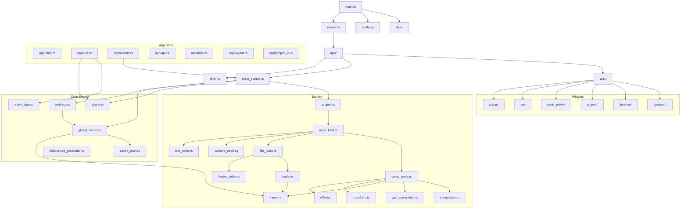
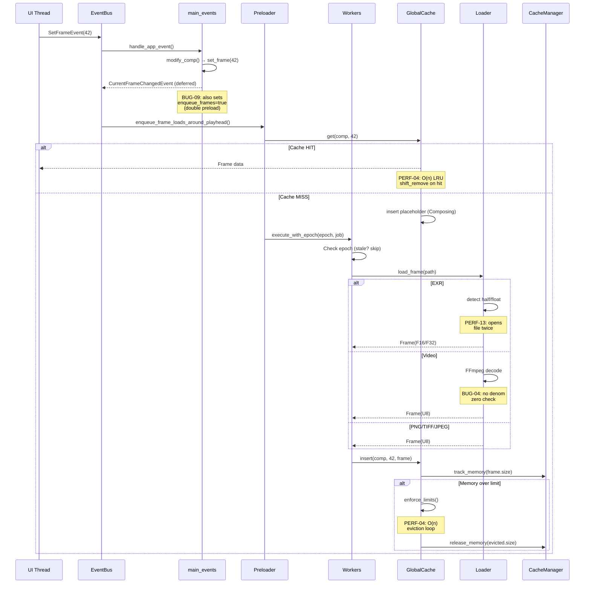
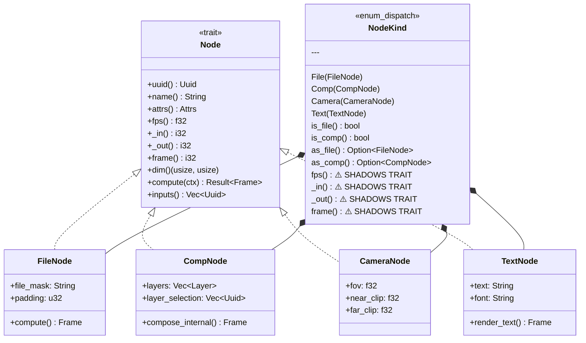

# Playa Architecture Diagrams

## 1. High-Level Module Dependency



## 2. Frame Loading Pipeline



## 3. Composition Pipeline

```mermaid
flowchart TD
    A[compose_internal] --> B{is_dirty?}
    B -->|recursive check| B
    B -->|dirty| C[collect visible layers]
    B -->|clean + cached| Z[return cached]

    C --> D[for each layer]
    D --> E{source type?}
    E -->|FileNode| F[load from loader]
    E -->|CompNode| G[recursive compose]
    E -->|TextNode| H[render_text]
    E -->|CameraNode| I[skip non-renderable]

    F --> J[apply effects]
    G --> J
    H --> J

    J --> K{has effects?}
    K -->|blur| L[to_f32 + convolve H + convolve V]
    K -->|brightness| M[adjust per pixel]
    K -->|hsv| N[rgb→hsv→adjust→rgb]
    K -->|none| O[passthrough]

    L --> P[apply transform]
    M --> P
    N --> P
    O --> P

    P --> Q[collect source_frames vec]
    Q --> R[promote_frame - format unify]

    R --> S{GPU available?}
    S -->|yes| T[gpu_compositor.blend]
    S -->|no| U[cpu compositor.blend]

    T --> V{success?}
    V -->|yes| W[download texture]
    V -->|no| U

    U --> X[blend_with_dim]

    Note over X: BUG-01: NaN on<br/>transparent pixels
    Note over X: PERF-01: clones<br/>buffer per layer
    Note over X: PERF-03: match<br/>per pixel

    X --> Y[insert into GlobalCache]
    W --> Y
    Y --> Z[return Frame]
```

## 4. Event System Flow

```mermaid
flowchart LR
    subgraph Sources
        KB[Keyboard]
        MS[Mouse]
        API[REST API]
        TMR[Timer/Player]
    end

    subgraph EventBus
        IM[Immediate Subscribers]
        DQ[Deferred Queue<br/>max 1000 events]
    end

    subgraph MainLoop["Main Loop (60Hz)"]
        POLL[poll events]
        HAE[handle_app_event<br/>1232 lines, 16 params]
        DER[Derived Events Loop<br/>max 10 iterations]
    end

    KB --> EventBus
    MS --> EventBus
    API --> EventBus
    TMR --> EventBus

    EventBus --> IM
    EventBus --> DQ

    DQ --> POLL
    POLL --> HAE
    HAE --> DER
    DER -->|re-emit| DQ

    Note over DQ: ARCH-08: silently<br/>drops 500 events<br/>on overflow

    Note over HAE: ARCH-01: god function<br/>needs AppEventContext

    Note over DER: ARCH: ViewportRefresh<br/>re-entrance wastes<br/>iteration budget
```

## 5. Node Type Hierarchy



## 6. Cache Architecture

```mermaid
flowchart TD
    subgraph GlobalFrameCache
        CACHE["cache: HashMap&lt;Uuid, HashMap&lt;i32, Frame&gt;&gt;"]
        LRU["lru_order: IndexSet&lt;CacheKey&gt;<br/>⚠️ O(n) shift_remove"]
        STATS["CacheStats: hits/misses AtomicU64"]
    end

    subgraph CacheManager
        MEM["memory_usage: AtomicUsize"]
        MAX["max_memory: AtomicUsize (75% RAM)"]
        EPOCH["current_epoch: AtomicU64"]
        DIRTY["dirty_repaint: AtomicBool"]
    end

    subgraph "Frame States"
        HDR[Header] --> |try_claim| LDG[Loading]
        LDG --> |success| LOD[Loaded]
        LDG --> |failure| ERR[Error]
        LOD --> |dehydrate| EXP[Expired]
        EXP --> |reload| LDG
        ERR --> |retry| HDR

        Note over LDG,EXP: BUG-10: dehydrate can<br/>race with Loading
    end

    GlobalFrameCache --> CacheManager
    CACHE --> |get/insert| LRU
    LRU --> |evict| CacheManager
```
