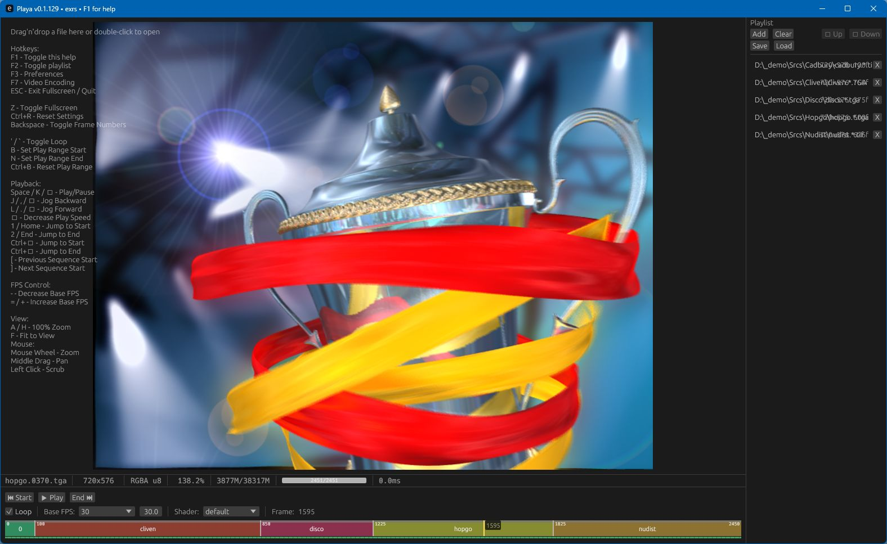

# Playa - Image Sequence Player

[](https://github.com/ssoj13/playa/actions/workflows/main.yml)
[](https://github.com/ssoj13/playa/actions/workflows/warm-cache.yml)
[](https://github.com/ssoj13/playa/releases/latest)
[](https://github.com/ssoj13/playa/releases)
[](LICENSE)
[](https://github.com/ssoj13/playa)
[](CHANGELOG.md)

Playa is an image sequence player for VFX workflows. Async loading, OpenGL rendering, Video encoding, simple UI, single binary.




## Features

- **Dual EXR backends**: Choose between pure Rust (exrs) for fast builds or OpenEXR C++ for full DWAA/DWAB compression support
- **FFmpeg-based decoding/encoding** via `playa-ffmpeg` crate and with hardware acceleration: NVENC (NVIDIA), QSV (Intel), AMF (AMD)
- **Native Rust Multi-format support**: EXR, PNG, JPEG, TIFF, TGA with fast parallel loading.
- **Pixel format**: Supports u8 / f16 (half-float) / f32 images
- **Smart sequence detection**: Load one frame (e.g., `render.0001.exr`) - finds all frames automatically
- **Persistent playlist**: persistent between sessions, i.e. it starts where you left the app
- **Color-coded timeline**: Visual sequence boundaries with real-time frame load indicators
- **Responsive scrubbing**: Instant frame navigation - always responsive even during fast scrubbing
- **Play range support**: Plays/Encodes just selected play range (B/N markers)
- **Playback controls**: Standard transport controls (play/pause, JKL shuttle, loop)
- **Viewport controls**: Zoom, pan, fit-to-window, 100% pixel-perfect view, cursor-centered zoom, full screen mode
- **Custom GLSL shaders**: Uses preset shaders plus looks for extra in `shaders/` folder - LUTs, color transforms, custom effects
- **Smart memory management**: Automatically manages cache size - never runs out of memory
- **Persistent settings**: Settings automatically stored and restored between sessions
- **Rich CLI arguments support**: Load separate files and playlists from command line
- **Supports different resolution**: on encoding they will be just cropped

**Small note**: This is a learning project.  
I'm really excited to discover the Rust universe and AI agents are helping to quickly grasp things.  
I know what I want to build and supposed app architecture, but implementing that alone would take months.  
Also now open source community have a half-decent cross-platform image sequence player made of a single binary.  
I really wanted to express my gratitude towards creators and maintainers of `exrs`, `openexr-rs`, `rust-ffmpeg` crates (and of course the rest) - Rust is amazing!


## Video Support

Playa now supports video playback alongside image sequences:

**Supported formats**: MP4, MOV, AVI, MKV

**Requirements**:
- Vcpkg with FFmpeg libraries (auto-detected via vcpkg on Windows)
- `playa-ffmpeg` crate handles all FFmpeg bindings

## Video Encoding

Playa includes built-in video encoding (F4 hotkey) for exporting image sequences and play ranges to video files.

**Supported Encoders**:

| Encoder | Type | Platform | Notes |
|---------|------|----------|-------|
| `h264_nvenc` | Hardware | Windows/Linux | NVIDIA GPUs (GTX 600+) |
| `hevc_nvenc` | Hardware | Windows/Linux | NVIDIA GPUs (GTX 900+) |
| `h264_qsv` | Hardware | Windows/Linux | Intel Quick Sync (HD 2000+) |
| `hevc_qsv` | Hardware | Windows/Linux | Intel Quick Sync (Skylake+) |
| `h264_amf` | Hardware | Windows | AMD GPUs |
| `hevc_amf` | Hardware | Windows | AMD GPUs |
| `libx264` | Software | All | CPU-based H.264 |
| `libx265` | Software | All | CPU-based H.265 |
| `mpeg4` | Software | All | Legacy MPEG-4 Part 2 |

**Usage**:
1. Load image sequence or video
2. **(Optional)** Set play range with **B** (begin) and **N** (end) markers
   - Press **B** to mark the start frame
   - Press **N** to mark the end frame
   - Press **Ctrl-B** reset the play range
   - Visual indicators appear on the timeline showing the active range
   - Clear markers to encode the entire sequence
3. Press **F4** to open encoding dialog
4. Select codec, quality settings, and output path
5. Click "Encode" - progress shown in real-time with cancel option
6. Output file written to selected location

**Requirements & Limitations**:
- **Resolution consistency**: All frames must have identical width and height
  - Encoder will fail if frame dimensions vary within the sequence
  - Ensure source material has uniform resolution before encoding
- **Play range encoding**: Only frames between B (begin) and N (end) markers are encoded
  - If no markers are set, the entire sequence is encoded
  - Markers are visually indicated on the timeline
  - Frame range is inclusive (both B and N frames are included)

**Technical details**:
- Automatic pixel format conversion (RGB24 → YUV420P for hardware encoders)
- Uses FFmpeg swscale for color space conversion
- Multi-threaded encoding via background worker thread
- Cancellable operation with atomic flag
- Frame timestamps calculated from sequence frame rate

## Installation

### Recommended: Download Pre-built Installers

**The easiest way** to install Playa - download and run the installer for your platform:

Download the latest release from the [Releases page](https://github.com/ssoj13/playa/releases/latest):

**macOS (recommended: DMG):**
- 🎯 `playa-x.x.x-exrs.dmg` - **Recommended** - Drag to Applications (code-signed & notarized)
- `playa-x.x.x-openexr.dmg` - With DWAA/DWAB compression support (code-signed & notarized)
- Portable: `playa-exrs-aarch64-apple-darwin.zip` (single binary)

**Linux (recommended: AppImage):**
- 🎯 `playa-x.x.x-exrs.AppImage` - **Recommended** - Universal, runs everywhere
- `playa-x.x.x-exrs.deb` - Debian/Ubuntu package
- Portable: `playa-exrs-x86_64-unknown-linux-gnu.zip` (single binary)
- OpenEXR variants: `-openexr.AppImage` / `-openexr.deb` with DWAA/DWAB support

**Windows (choose one):**
- 🎯 `playa-x.x.x-exrs-x64-setup.exe` - **Installer** - System integration
- `playa-x.x.x-exrs-x64.msi` - **MSI** - Enterprise deployments
- `playa-exrs-x86_64-pc-windows-msvc.zip` - **Portable** - Single .exe (no DLLs)
- OpenEXR variants: `-openexr-` prefix - Include DLLs for DWAA/DWAB compression

**macOS Security Note:**
All DMG releases are code-signed with Developer ID and notarized by Apple. No Gatekeeper warnings - just drag to Applications and run.

---

### Alternative: cargo install

Install from crates.io (requires manual FFmpeg setup):

```bash
cargo install playa
```

**⚠️ Requirements:**

1. **vcpkg** must be installed and configured:
   ```bash
   # Windows
   git clone https://github.com/microsoft/vcpkg.git C:\vcpkg
   C:\vcpkg\bootstrap-vcpkg.bat
   setx VCPKG_ROOT "C:\vcpkg"
   setx VCPKGRS_TRIPLET "x64-windows-static-md-release"

   # Linux/macOS
   git clone https://github.com/microsoft/vcpkg.git /usr/local/share/vcpkg
   /usr/local/share/vcpkg/bootstrap-vcpkg.sh
   export VCPKG_ROOT=/usr/local/share/vcpkg
   ```

2. **FFmpeg** with static linking:
   ```bash
   # Windows
   vcpkg install ffmpeg[core,avcodec,avdevice,avfilter,avformat,swresample,swscale,nvcodec]:x64-windows-static-md-release

   # Linux
   export VCPKGRS_TRIPLET=x64-linux-release
   vcpkg install ffmpeg[...]:x64-linux-release

   # macOS
   export VCPKGRS_TRIPLET=arm64-osx-release  # or x64-osx-release for Intel
   vcpkg install ffmpeg[...]:arm64-osx-release
   ```

**See "FFmpeg Setup" section below for complete instructions.**

---

### Build from Source (Development)

**For most users:** Use pre-built installers above or `cargo install`.

**For developers:** Use bootstrap scripts that automatically handle all dependencies and environment setup.

#### Quick Start with Bootstrap

Bootstrap scripts provide the easiest build experience with automatic dependency management:

```bash
# Clone repository
git clone https://github.com/ssoj13/playa.git
cd playa

# Windows
bootstrap.cmd build          # Build with exrs (fast, pure Rust)
bootstrap.cmd build --openexr  # Build with OpenEXR (full DWAA/DWAB support)

# Linux/macOS
./bootstrap.sh build
./bootstrap.sh build --openexr
```

**What bootstrap does:**

1. **Checks Rust installation** - Exits with error if missing
2. **Sets up vcpkg environment variables** automatically:
   - `VCPKG_ROOT` - Points to vcpkg installation
   - `VCPKGRS_TRIPLET` - Platform-specific triplet (e.g., `x64-windows-static-md-release`)
   - `PKG_CONFIG_PATH` - For FFmpeg pkg-config files (Linux/macOS)
3. **Installs dev tools** via cargo-binstall:
   - `cargo-release` - Version bumping and changelog
   - `cargo-packager` - Cross-platform installer generation
4. **Builds xtask** - Project build automation helper
5. **Forwards to xtask** - Handles actual compilation with correct configuration

**Benefits over manual cargo build:**
- ✅ Guaranteed correct FFmpeg linking configuration
- ✅ Same setup as CI/CD builds
- ✅ No manual environment variable setup
- ✅ Handles platform-specific triplets automatically
- ✅ Works identically on Windows, Linux, and macOS

**After bootstrap:** Continue using `bootstrap.{sh|cmd}` or use `cargo xtask` directly.

#### EXR Backend Options

Playa supports two EXR backends:

| Backend | Build Command | Dependencies | DWAA/DWAB Support |
|---------|--------------|--------------|-------------------|
| **exrs** (default) | `cargo build --release` | None (pure Rust) | No |
| **OpenEXR** (optional) | `cargo xtask build --release --openexr` | C++ compiler, CMake | Yes |

#### Option 1: Default Build (exrs - Pure Rust)

Fast build with no external dependencies. Suitable for most workflows:

```bash
git clone https://github.com/ssoj13/playa.git
cd playa

# Build with exrs backend (pure Rust, no DLLs)
cargo build --release
```

The compiled binary will be in `target/release/playa` (or `playa.exe` on Windows).

**Limitations**: Cannot load EXR files with DWAA/DWAB compression. Will show helpful error message with build instructions.

#### Option 2: Full OpenEXR Support (C++ Backend)

Supports all EXR compression formats including DWAA/DWAB:

**Prerequisites:**
- Rust 1.85+ (edition 2024)
- C++ compiler and CMake

```bash
git clone https://github.com/ssoj13/playa.git
cd playa

# Build with OpenEXR backend (full format support)
cargo xtask build --release --openexr
```

**Note:** OpenEXR backend compiles C++ libraries (~5-10 minutes first build, then cached).

### FFmpeg Setup (Video Playback & Encoding)

Playa requires FFmpeg libraries for video support. Install via vcpkg for best compatibility:

#### Windows

```powershell
# Install vcpkg (if not already installed)
git clone https://github.com/microsoft/vcpkg.git C:\vcpkg
C:\vcpkg\bootstrap-vcpkg.bat

# Set environment variables (required for Rust to find FFmpeg)
# Add these permanently to your system environment variables:
setx VCPKG_ROOT "C:\vcpkg"
setx VCPKGRS_TRIPLET "x64-windows-static-md-release"

# Install FFmpeg with static linking and hardware acceleration support
C:\vcpkg\vcpkg install ffmpeg[core,avcodec,avdevice,avfilter,avformat,swresample,swscale,nvcodec]:x64-windows-static-md-release
```

**Important:** The `VCPKGRS_TRIPLET` environment variable tells Rust's vcpkg integration which triplet to use. The `x64-windows-static-md-release` triplet provides static library linkage with optimized release builds, creating self-contained binaries without requiring FFmpeg DLLs at runtime.

**Features explained**:
- `core,avcodec,avformat,swscale,swresample` - Core libraries (required)
- `avdevice,avfilter` - Device input and filtering support
- `nvcodec` - NVIDIA NVENC hardware encoding (GTX 600+)

**Setup Visual Studio environment** (before building):
```cmd
"C:\Program Files\Microsoft Visual Studio\2022\Community\VC\Auxiliary\Build\vcvars64.bat"
```

#### Linux

```bash
# Install vcpkg
git clone https://github.com/microsoft/vcpkg.git /usr/local/share/vcpkg
/usr/local/share/vcpkg/bootstrap-vcpkg.sh

# Set environment variables
export VCPKG_ROOT=/usr/local/share/vcpkg
export VCPKGRS_TRIPLET=x64-linux-release
export PKG_CONFIG_PATH=$VCPKG_ROOT/installed/$VCPKGRS_TRIPLET/lib/pkgconfig

# Install FFmpeg with hardware encoder support
vcpkg install ffmpeg[core,avcodec,avdevice,avfilter,avformat,swresample,swscale,nvcodec]:x64-linux-release
```

**Hardware encoders on Linux**:
- `nvcodec` - NVIDIA NVENC (requires CUDA drivers)

#### macOS

```bash
# Install vcpkg
git clone https://github.com/microsoft/vcpkg.git /usr/local/share/vcpkg
/usr/local/share/vcpkg/bootstrap-vcpkg.sh

# Set environment variables (automatically detected by bootstrap.sh)
export VCPKG_ROOT=/usr/local/share/vcpkg

# M1/M2 Macs
export VCPKGRS_TRIPLET=arm64-osx-release
export PKG_CONFIG_PATH=$VCPKG_ROOT/installed/arm64-osx-release/lib/pkgconfig
vcpkg install ffmpeg[core,avcodec,avdevice,avfilter,avformat,swresample,swscale]:arm64-osx-release

# Intel Macs
export VCPKGRS_TRIPLET=x64-osx-release
export PKG_CONFIG_PATH=$VCPKG_ROOT/installed/x64-osx-release/lib/pkgconfig
vcpkg install ffmpeg[core,avcodec,avdevice,avfilter,avformat,swresample,swscale]:x64-osx-release
```


**Note**: macOS hardware encoding (VideoToolbox) requires system FFmpeg or manual FFmpeg build with `--enable-videotoolbox`.

### Verifying FFmpeg Installation

```bash
# Check FFmpeg availability
pkg-config --modversion libavcodec libavformat libavutil libswscale

# List available encoders (after building playa)
ffmpeg -encoders | grep -E "(nvenc|qsv|amf|264|265)"

# Test encoding (requires playa built)
bootstrap.cmd test    # Windows
./bootstrap.sh test   # Linux/macOS
```

## Quick Start (New Contributors)

**Start here!** Bootstrap scripts handle all dependencies automatically:

### Windows
```cmd
bootstrap.cmd              # Show xtask help
bootstrap.cmd build        # Build with exrs (fast)
bootstrap.cmd build --openexr  # Build with full OpenEXR support
bootstrap.cmd test         # Run encoding integration test
```

### Linux/macOS
```bash
./bootstrap.sh             # Show xtask help
./bootstrap.sh build       # Build with exrs (fast)
./bootstrap.sh build --openexr  # Build with full OpenEXR support
./bootstrap.sh test        # Run encoding integration test
```

**What bootstrap does:**
1. Checks Rust installation (exits with error if missing)
2. Auto-installs dependencies via `cargo-binstall` (faster than `cargo install`):
   - `cargo-release` - Version bumping and changelog generation
   - `cargo-packager` v0.11.7 - Cross-platform installer generation
3. Builds `xtask` binary (project build automation)
4. Forwards all arguments to `cargo xtask`

**After bootstrap:** Use `cargo xtask <command>` directly or continue with `bootstrap.{sh|cmd} <command>`

### Using xtask - Project Build Automation

**Prerequisites:** Run `bootstrap.{sh|cmd}` first (see Quick Start above)

`xtask` is an idiomatic Rust pattern for build automation - a workspace helper binary providing cross-platform task automation without external dependencies (no Makefiles, no Python, no shell scripts).

**Why xtask?**
- **Cross-platform**: Same commands work identically on Windows, Linux, and macOS
- **Type-safe**: Catch errors at compile time, not runtime
- **Self-documenting**: Built-in `--help` with structured command definitions
- **Pure Rust**: Uses project's existing toolchain, no external tools needed

#### Available Commands

##### 🏗️ Build & Development
```bash
cargo xtask build [--release] [--openexr]  # Full build (default: exrs)
cargo xtask post [--release]               # Copy native libraries (OpenEXR only)
cargo xtask verify [--release]             # Verify dependencies present
cargo xtask deploy [--install-dir PATH]    # Install to system
  # Windows: %LOCALAPPDATA%\Programs\playa
  # Linux/macOS: ~/.local/bin/playa
```

##### 🚀 Release Management
```bash
cargo xtask tag-dev [patch|minor|major]  # Create v0.1.x-dev tag → trigger Build workflow
cargo xtask tag-rel [patch|minor|major]  # Create v0.1.x tag → trigger Release workflow
cargo xtask pr [version]                 # Create PR: dev → main with all commits
cargo xtask changelog                    # Preview unreleased CHANGELOG.md
```

##### 🔧 Platform-Specific
```bash
cargo xtask pre   # Linux only: Patch OpenEXR headers for GCC 11+ compatibility
```

#### What `cargo xtask build` Does

**Without `--openexr` (default - exrs backend):**
1. Runs `cargo build [--release]` with pure Rust exrs backend
2. Self-contained single binary (no dependencies copied)

**With `--openexr` (OpenEXR C++ backend):**
1. **Linux**: Patches OpenEXR headers for GCC 11+ compatibility
2. **All platforms**: Runs `cargo build [--release] --features openexr`
3. **All platforms**: Copies native libraries (OpenEXR, Imath, zlib, openexr-c) to target directory
4. **All platforms**: Copies shaders from project root
5. **Linux**: Creates necessary symlinks for library loading

#### Common Workflows

**Local development (fast):**
```bash
./bootstrap.sh build        # or cargo xtask build
./target/debug/playa
```

**Local development (full OpenEXR):**
```bash
./bootstrap.sh build --openexr
./target/debug/playa
```

**Install to system:**
```bash
cargo xtask build --release --openexr
cargo xtask deploy
# Now available as: playa
```

#### Linux-Specific Build Notes

**Note:** These instructions apply only to the OpenEXR C++ backend (`--openexr` feature). The default exrs backend requires no external dependencies.

**OpenEXR GCC 11+ Header Patching:**

OpenEXR 3.0.5 headers are missing `#include <cstdint>`, causing compilation errors with GCC 11+:
```
error: 'uint64_t' has not been declared
```

`cargo xtask pre` automatically patches 3 header files in `~/.cargo/registry/src/`:
- `ImfTiledMisc.h`
- `ImfDeepTiledInputFile.h`
- `ImfDeepTiledInputPart.h`

The patching is **idempotent** and **version-agnostic** - safe to run multiple times.

See: https://github.com/AcademySoftwareFoundation/openexr/issues/1157

**Native Libraries (7 Required):**

| Library | Purpose |
|---------|---------|
| OpenEXR Core (4 libs) | EXR reading/writing, utilities, threading, exceptions |
| Imath | Math library |
| Zlib | Compression |
| OpenEXR-C | C API wrapper from openexr-sys |


## macOS Code Signing & Notarization

### For Users

All macOS DMG releases are **code-signed** with Developer ID and **notarized** by Apple:
- ✅ No Gatekeeper warnings
- ✅ No "unidentified developer" dialogs
- ✅ Double-click DMG → drag to Applications → works immediately


## Usage

### Launch

#### Basic Usage
```bash
# Start with empty player (drag-and-drop or file dialog)
playa

# Load specific file or sequence
playa path/to/image.0001.exr

# Load multiple files (detects sequences automatically)
playa file1.exr file2.exr
```

#### Command-Line Arguments

**File Loading:**
```bash
# Load single file (positional argument)
playa image.0001.exr

# Load multiple files (detects sequences for each)
playa -f seq1.0001.exr -f seq2.0001.exr

# Load saved playlist
playa -p playlist.json

# Combine files and playlist (loaded in command-line order)
playa image.exr -f seq1.exr -f seq2.exr -p playlist.json
```

**Playback Control:**
```bash
# Start in fullscreen (cinema mode)
playa -F image.exr

# Set starting frame (0-based)
playa --frame 100 image.exr

# Auto-start playback
playa -a image.exr

# Disable looping
playa -o 0 image.exr

# Set play range (work area)
playa --start 10 --end 50 image.exr
playa --range 10 50 image.exr        # Shorthand
```

**Configuration:**
```bash
# Use custom config directory
playa --config-dir ~/.playa

# Override memory budget (percentage of system RAM)
playa --mem 75

# Set worker thread count
playa --workers 8
```

**Logging:**
```bash
# Enable file logging (default: playa.log)
playa --log

# Log to custom file
playa --log custom.log

# Increase verbosity (default: warn)
playa -v              # Info level
playa -vv             # Debug level
playa -vvv            # Trace level (maximum detail)
```

**Full Example:**
```bash
# Load sequence, start at frame 50, auto-play in fullscreen with debug logging
playa -f render.0001.exr --frame 50 -a -F --range 0 100 -vv --log
```

**Help:**
```bash
# Show all available options
playa --help

# Show version
playa --version
```

**Note:** When starting without any arguments, help text is automatically printed to console before launching the GUI.

### Keyboard Shortcuts

**Playback Controls:**
- `Space` / `K` / `↑` - Play/Pause (unified control)
- `J` / `,` / `←` - Jog backward (starts playback, increases speed if already playing)
- `L` / `.` / `→` - Jog forward (starts playback, increases speed if already playing)
- `↓` - Decrease play speed (only when playing)
- `1` / `Home` - Jump to start
- `2` / `End` - Jump to end
- `Ctrl+←` - Jump to start
- `Ctrl+→` - Jump to end
- `[` - Jump to previous sequence start
- `]` - Jump to next sequence start
- `'` / `` ` `` - Toggle loop

**FPS Control:**
- `-` - Decrease base FPS (persistent setting)
- `=` / `+` - Increase base FPS (persistent setting)
- Base FPS steps through presets: 1, 2, 4, 8, 12, 24, 30, 60, 120, 240
- Play speed (J/L) resets to base FPS on stop

**Viewport:**
- `F` - Fit to window (auto-fit mode)
- `A` / `H` - 100% zoom
- `Mouse Wheel` - Zoom in/out (center on cursor)
- `Middle Mouse Drag` - Pan
- `Left Click + Drag` - Scrub timeline

**Play Range (Work Area):**
- `B` - Set play range start (begin marker)
- `N` - Set play range end (end marker)
- `Ctrl+B` - Reset play range to full sequence
- Used for:
  - Loop playback within selected range
  - Encoding only selected frames (F7)
  - Timeline highlighting

**UI:**
- `F1` - Toggle help overlay
- `F2` - Toggle playlist panel
- `F3` - Toggle settings dialog
- `F7` - Open video encoding dialog
- `Z` - Toggle fullscreen (cinema mode)
- `ESC` - Exit fullscreen / Quit
- `Q` - Quit
- `Ctrl+R` - Reset settings to default
- `Backspace` - Toggle frame numbers on timeline (shows global range, sequence starts, play range)

### Visual Sequence Navigation

The time slider provides visual feedback for multi-sequence playback:
- **Color-coded zones**: Each loaded sequence is displayed with a unique color on the timeline
- **Sequence boundaries**: White vertical dividers mark where sequences start/end
- **Load indicator bar**: Colored blocks below timeline show frame load status:
  - Dark gray: Placeholder (not requested)
  - Blue: Header only (detected but not loaded)
  - Orange: Currently loading
  - Green: Fully loaded
  - Red: Load error
- **Adaptive labels**: Sequence names appear on the timeline when space permits
- **Instant navigation**: Click or drag anywhere on the timeline to jump to that frame

This makes it easy to identify and navigate between different sequences in your playlist at a glance.

### Settings Dialog

Press `F3` to open the settings dialog with TreeView categories:

**UI Category:**
- **Font Size**: Adjust global UI font size (10-18px, default 13px)
- **Dark Mode**: Toggle between dark and light themes

Settings are automatically persisted to `playa.json`.

## Architecture

### Core Components

```
┌─────────────┐
│  PlayaApp   │  Main application (egui/eframe)
└──────┬──────┘
       │
       ├──── Player ───────┐
       │                   │
       │              ┌────▼────┐
       │              │  Cache  │  LRU cache + async loader + epoch counter
       │              └────┬────┘
       │                   │
       │              ┌────▼────────┐
       │              │  Sequences  │  Pattern-based frame lists
       │              └────┬────────┘
       │                   │
       │              ┌────▼────┐
       │              │ Frames  │  Individual images with status
       │              └─────────┘
       │
       ├──── Viewport ────┐
       │                  │
       │            ┌─────▼──────────┐
       │            │ ViewportState  │  Zoom/pan/fit modes
       │            └────────────────┘
       │
       ├──── Scrubber ────  Timeline interaction
       │
       ├──── TimeSlider ──  Custom time slider widget + load indicator
       │
       ├──── Shaders ─────  OpenGL display shaders
       │
       └──── Prefs ───────  Settings dialog with TreeView
```

### Module Breakdown

#### `main.rs`
Entry point and main application loop. Handles:
- CLI argument parsing
- Window initialization (egui/eframe)
- Event loop and UI rendering
- Keyboard/mouse input routing
- Settings persistence (JSON)
- Global font size application

#### `player.rs`
Playback state manager. Controls:
- Play/pause/stop
- Frame navigation (jog, shuttle)
- FPS control with presets
- Loop mode
- Delegates frame access to Cache

#### `cache.rs`
Intelligent caching system with multi-threaded architecture:
- **LRU eviction**: Manages memory budget (default 50% system RAM)
- **Epoch counter**: Atomic counter for cancelling stale load requests during scrubbing
- **Worker pool**: 75% of CPU cores for parallel loading
- **Load queue**: mpsc channel-based task distribution with epoch tagging
- **Preload thread**: Background spiral loading from current frame
- **Sequence management**: Multi-sequence playlist support
- **Frame status tracking**: Provides frame load state for visualization

**Caching strategy:**
1. On-demand loading: Loads frame when accessed
2. Spiral preload: Loads frames in order: 0, +1, -1, +2, -2, ...
3. Epoch-based cancellation: Workers skip requests with old epoch on scrub/seek
4. Memory-aware: Evicts least-recently-used frames when over budget
5. Status sync: Updates frame status (Header → Loading → Loaded/Error)

**Epoch Counter Pattern:**
- `current_epoch: Arc<AtomicU64>` increments on every scrub/seek
- Workers check `req.epoch != current_epoch` and skip stale requests
- Prevents wasted work on frames user has already moved past

#### `sequence.rs`
Pattern-based frame sequence detection:
- Auto-detects sequences from single file (e.g., `render.0001.exr` → `render.*.exr`)
- Glob pattern matching
- Frame number extraction with padding detection
- Directory scanning for multiple sequences
- Header-only resolution reading (fast)

#### `frame.rs`
Individual frame with thread-safe async loading:
- **Status states**: Placeholder → Header → Loading → Loaded/Error
- **Arc<Mutex<FrameData>>**: Thread-safe shared ownership
- **Format loaders**: EXR (OpenEXR), PNG/JPEG/TIFF (image-rs)
- **Color conversion**: Linear → sRGB for EXR
- **Green placeholder**: Visible indicator for unloaded frames
- **Status API**: `frame.status()` for load indicator visualization

#### `viewport.rs`
Display transformation and interaction:
- **Modes**: AutoFit (scales to window), Auto100 (1:1 pixels), Manual (user control)
- **Zoom**: Mouse wheel with cursor-centered scaling
- **Pan**: Middle-mouse drag
- **OpenGL rendering**: Custom shader pipeline

#### `scrub.rs`
Interactive timeline scrubbing:
- Left-click/drag to navigate frames
- Visual feedback (vertical line + frame number)
- Auto-pauses playback during scrub
- Maps mouse X to frame based on image bounds
- Triggers epoch counter increment for stale request cancellation

#### `timeslider.rs`
Custom time slider widget with sequence visualization:
- **Color-coded zones**: Each sequence rendered with unique color (hash-based)
- **Visual dividers**: Vertical lines marking sequence boundaries
- **Adaptive labels**: Sequence names/numbers displayed when space permits
- **Load indicator**: Colored blocks showing frame status (cached for performance)
- **Cache invalidation**: Uses `cached_frames_count()` to detect when to rebuild
- **Stateless immediate mode**: Fully synchronized with player state
- **Interactive**: Click/drag to navigate, automatic playhead tracking
- **HSV color generation**: Stable colors derived from sequence pattern hash

**Load Indicator Implementation:**
- Queries `cache.get_frame_stats()` for all frame statuses
- Caches result in `egui::Memory` with version key
- Invalidates cache when `cached_frames_count()` changes
- Draws colored blocks: Dark gray (Placeholder), Blue (Header), Orange (Loading), Green (Loaded), Red (Error)

#### `shaders.rs`
OpenGL shader management:
- Built-in shaders (default, checker, etc.)
- Custom shader loading from `shaders/` directory
- Runtime shader switching

#### `prefs.rs`
Settings dialog with TreeView navigation:
- **AppSettings struct**: Centralizes all user preferences
- **SettingsCategory enum**: General, UI categories
- **TreeView integration**: Uses `egui_ltreeview` for hierarchical navigation
- **Font size control**: Global UI font size (10-18px with live preview)
- **Theme toggle**: Dark/light mode switching
- **Persistence**: Selected category and all settings saved to JSON
- **Window layout**: 700×500 default, resizable with ScrollArea

## Data Flow

```
User Action (drag-drop / file dialog / CLI arg)
    │
    ▼
load_sequence(PathBuf)
    │
    ├──► cache.ingest(paths)
    │        │
    │        ├──► Sequence::detect() ──► Parse patterns
    │        │                           Extract frame numbers
    │        │                           Create Frame objects (status: Header)
    │        │
    │        └──► append_seq() ──────► Add to cache.sequences
    │                                   Update global frame range
    │                                   Rebuild frame_paths_cache
    │
    └──► signal_preload() ─────────► Preload thread wakes up
                                      Increments epoch counter
                                      Sends LoadRequests with current epoch

Playback Update Loop
    │
    ▼
player.update()
    │
    ├──► Advance frame based on FPS/direction
    │
    └──► cache.get_frame(idx)
             │
             ├──► Check LRU cache ───► HIT: update access time, return frame
             │
             └──► MISS: Send LoadRequest with current epoch
                         │
                         ▼
                  Worker threads (75% cores)
                         │
                         ├──► Check epoch ────► Stale? Skip request
                         │
                         ├──► frame.load() ─────► Detect format (EXR/PNG/etc)
                         │                        Update status: Loading
                         │                        Load pixels from disk
                         │                        Convert color space
                         │                        Update status: Loaded/Error
                         │
                         └──► Send LoadedFrame via channel
                                     │
                                     ▼
                              cache.process_loaded_frames()
                                     │
                                     ├──► Ensure space (LRU eviction)
                                     ├──► Insert into cache
                                     ├──► Update sequence frame reference
                                     └──► Send CacheMessage for UI updates

Scrub/Seek Event
    │
    ▼
    ├──► Increment epoch counter ────► Cancel all in-flight requests
    │
    └──► Trigger preload with new epoch

Render Loop
    │
    ▼
UI update
    │
    ├──► Apply global font size from settings
    │
    ├──► Apply theme (dark/light) from settings
    │
    ├──► Get current frame from cache
    │
    ├──► Upload texture to GPU (if frame changed)
    │
    ├──► TimeSlider with load indicator
    │        │
    │        ├──► Check cached_frames_count()
    │        ├──► Rebuild indicator cache if changed
    │        └──► Draw colored blocks for each frame
    │
    └──► ViewportRenderer.render()
             │
             └──► Apply viewport transform (zoom/pan)
                  Apply shader
                  Draw quad with texture

Settings Dialog (F3)
    │
    ▼
    ├──► TreeView navigation (General / UI)
    │
    ├──► Font size slider ───► Update AppSettings.font_size
    │                           Apply globally on next frame
    │
    ├──► Dark mode toggle ───► Update AppSettings.dark_mode
    │                           Switch theme immediately
    │
    └──► Auto-save to playa.json
```

## Performance Characteristics

- **Startup**: Instant (lazy loading)
- **Sequence detection**: Fast (header-only reads, ~1-5ms per file)
- **Frame loading**: Parallel (75% CPU cores)
- **Memory**: Self-limiting (50% system RAM, configurable)
- **Scrubbing**: Responsive (epoch-based cancellation + preloaded cache)
- **Playback**: Smooth (async loading stays ahead of playback)
- **Load indicator**: Efficient (cached, O(1) status lookups, rebuilds only on cache changes)
- **LRU cache**: Optimized (no stale keys in access_order, skips dead entries during eviction)

## Technical Stack

- **UI**: egui 0.33 + eframe
- **TreeView**: egui_ltreeview 0.6.0 (with persistence feature)
- **Graphics**: OpenGL via glow + egui_glow
- **Image**:
  - **EXR (default)**: exrs via image 0.25 (pure Rust)
  - **EXR (optional)**: openexr 0.11 (C++ bindings, `openexr` feature)
  - **Other formats**: image 0.25 (PNG/JPEG/TIFF/TGA/HDR)
- **Async**: std::thread + crossbeam-channel + mpsc
- **Concurrency**: AtomicU64 for epoch counter, Arc<Mutex> for shared state
- **CLI**: clap 4.5
- **Logging**: env_logger (set `RUST_LOG=debug` for verbose output)

## AI Dev experiment:

This project heavily relies on AI agents: Claude Code and Codex.
Without them development time could span months instead of a single week (still, pretty intensive).

**Human-designed architecture:**
- System design and component boundaries
- Performance targets and trade-offs
- UX workflows and user experience
- Security model and threat boundaries
- Release strategy and versioning

**AI-implemented components:**
- ✅ Build automation (`xtask` workspace - 11 commands, cross-platform)
- ✅ CI/CD workflows (cache warming API, branch detection, unified release)
- ✅ Bootstrap scripts (dependency management, error handling)
- ✅ Installer packaging (NSIS, MSI, DMG, DEB, AppImage)
- ✅ Apple signing pipeline (Developer ID, notarization, keychain management)
- ✅ Documentation (architecture diagrams, data flow, comprehensive README)

**Reality check:** AI agents make plenty of mistakes - wrong API usage, platform-specific bugs, over-engineered solutions. Human catches these through testing and directs corrections. Iteration is fast because agents are like instant encyclopaedia.

### What Works Well

**Speed:** Implement in minutes what would take days manually  
**Breadth:** Cross-platform knowledge (Windows/Linux/macOS quirks) instantly available  
**Consistency:** Code style, documentation, commit messages uniform across project  
**Tirelessness:** Agents iterate without frustration, test edge cases without boredom  

### What's not

**Logic:** "AI" is a great trickster.  
It can execute the task perfectly to your description, working completely incorrect and/or unexpected way.


## Contributing

I'm not looking for contributors, but if you think you can add some useful feature - be my guest.
Fork it, clone it, improve it, PR if you want.
Here's the [Contributing Guide](CONTRIBUTING.md) for details on:
- Commit message conventions (Conventional Commits)
- Development workflow and tools
- Release process
- CI/CD architecture


## Acknowledgements
Cool Halloween Cat app icon is taken from this cute [Flaticon icon pack by Yasashii std](http://flaticon.com/packs/halloween-18020037)  

See [CHANGELOG.md](CHANGELOG.md) for project history.