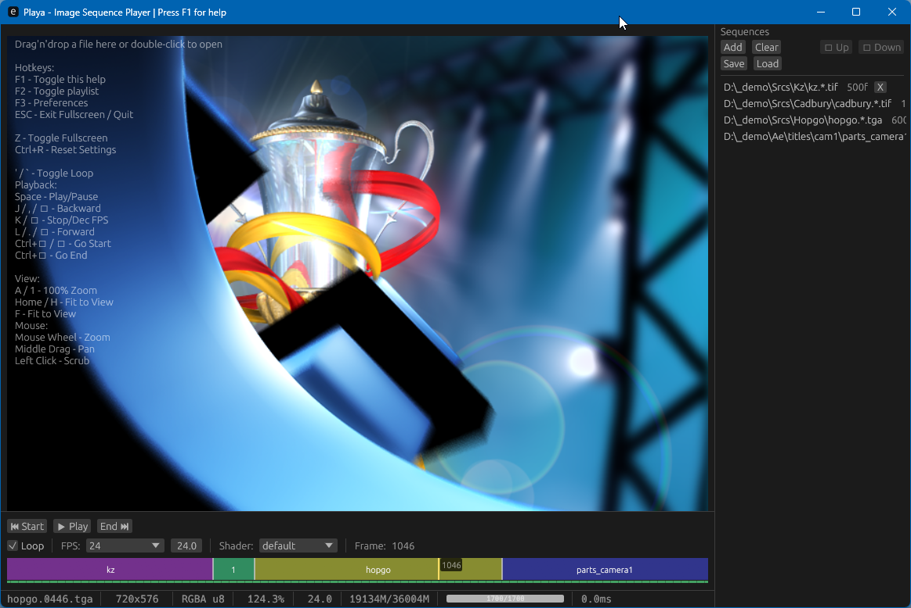

# Playa - Image Sequence Player

[](https://github.com/ssoj13/playa/actions/workflows/main.yml)
[](https://github.com/ssoj13/playa/actions/workflows/warm-cache.yml)
[](https://github.com/ssoj13/playa/releases/latest)
[](https://github.com/ssoj13/playa/releases)
[](LICENSE)
[](https://github.com/ssoj13/playa)
[](CHANGELOG.md)

**Small note**: This is a learning project. I'm really excited to discover the Rust universe and the rise of AI agentic coding techniques to quickly learn a new stack. I perfectly know what I want to build and supposed app architecture, but implementing that alone would be probably not possible within some reasonable timeframe (not within a week, definitely). Well, also now Rust users and open source community now have a half-decent cross-platform image sequence player made of a single binary. I really wanted to express my gratitude towards creators and maintainers of `exrs` and `openexr-rs` crates and of course the rest - Rust is amazing!

Short list of things resolved while building this tool:




Image sequence player for VFX workflows. Async loading, LRU caching, OpenGL rendering.

## Features

- **Dual EXR backends**: Choose between pure Rust (exrs) for fast builds or OpenEXR C++ for full DWAA/DWAB compression support
- **Native Rust Multi-format support**: EXR, PNG, JPEG, TIFF, TGA with fast parallel loading
- **HDR pixel precision**: Support for 8 / 16 / half-float / 32-bit float images
- **Drag-and-drop**: Drop any image file - automatically detects and loads the entire sequence
- **Smart sequence detection**: Load one frame (e.g., `render.0001.exr`) - finds all frames automatically
- **Persistent playlist**: Load multiple sequences, auto-saves and restores between sessions
- **Color-coded timeline**: Visual sequence boundaries with real-time frame load indicators
- **Responsive scrubbing**: Instant frame navigation - always responsive even during fast scrubbing, cancels stale loads automatically
- **Playback controls**: Standard transport controls (play/pause, JKL shuttle, loop)
- **Viewport controls**: Zoom, pan, fit-to-window, 100% pixel-perfect view, cursor-centered zoom
- **Custom GLSL shaders**: Load display shaders from `shaders/` directory - LUTs, color transforms, custom effects
- **Smart memory management**: Automatically manages cache size - never runs out of memory
- **Settings dialog**: Theme switching, font size, preferences (F3)
- **Cinema mode**: Fullscreen playback with hidden UI
- **Persistent settings**: Everything saves automatically - window layout, zoom level, shader selection

## Video Support

Playa now supports video playback alongside image sequences:

**Supported formats**: MP4, MOV, AVI, MKV

**Features**:
- Frame-by-frame video playback with seek support
- Automatic frame count detection
- Cached decoding with worker pool (same as image sequences)
- FFmpeg-based decoding via `playa-ffmpeg` crate

**Usage**:
- Open video file via drag-and-drop or file browser
- Videos appear in playlist with detected frame count
- Scrub timeline to seek through video frames
- All playback controls work identically to image sequences

**Technical details**:
- Videos internally use `@N` suffix notation (e.g., `video.mp4@17` for frame 17)
- Each frame decoded on-demand with YUV→RGB→RGBA conversion
- FFmpeg logging suppressed to avoid console spam
- Playlist serialization preserves video sequences correctly

**Requirements**:
- FFmpeg libraries (auto-detected via vcpkg on Windows)
- `playa-ffmpeg` crate handles all FFmpeg bindings

## Video Encoding

Playa includes built-in video encoding (F7 hotkey) for exporting image sequences and play ranges to video files.

**Features**:
- **F7 hotkey**: Opens encoding dialog with codec/quality settings
- **Play range support**: Encode only selected frames (B/N markers)
- **Hardware acceleration**: NVENC (NVIDIA), QSV (Intel), AMF (AMD)
- **Software codecs**: H.264, H.265, MPEG4
- **Containers**: MP4, MOV
- **Quality modes**: CRF (constant quality) or Bitrate
- **Progress tracking**: Real-time encoding progress with cancel support

**Supported Encoders**:

| Encoder | Type | Platform | Notes |
|---------|------|----------|-------|
| `h264_nvenc` | Hardware | Windows/Linux | NVIDIA GPUs (GTX 600+) |
| `hevc_nvenc` | Hardware | Windows/Linux | NVIDIA GPUs (GTX 900+) |
| `h264_qsv` | Hardware | Windows/Linux | Intel Quick Sync (HD 2000+) |
| `hevc_qsv` | Hardware | Windows/Linux | Intel Quick Sync (Skylake+) |
| `h264_amf` | Hardware | Windows | AMD GPUs |
| `hevc_amf` | Hardware | Windows | AMD GPUs |
| `libx264` | Software | All | CPU-based H.264 |
| `libx265` | Software | All | CPU-based H.265 |
| `mpeg4` | Software | All | Legacy MPEG-4 Part 2 |

**Usage**:
1. Load image sequence or video
2. **(Optional)** Set play range with **B** (begin) and **N** (end) markers
   - Press **B** to mark the start frame
   - Press **N** to mark the end frame
   - Visual indicators appear on the timeline showing the active range
   - Clear markers to encode the entire sequence
3. Press **F7** to open encoding dialog
4. Select codec, quality settings, and output path
5. Click "Encode" - progress shown in real-time with cancel option
6. Output file written to selected location

**Requirements & Limitations**:
- **Resolution consistency**: All frames must have identical width and height
  - Encoder will fail if frame dimensions vary within the sequence
  - Ensure source material has uniform resolution before encoding
- **Play range encoding**: Only frames between B (begin) and N (end) markers are encoded
  - If no markers are set, the entire sequence is encoded
  - Markers are visually indicated on the timeline
  - Frame range is inclusive (both B and N frames are included)

**Technical details**:
- Automatic pixel format conversion (RGB24 → YUV420P for hardware encoders)
- Uses FFmpeg swscale for color space conversion
- Multi-threaded encoding via background worker thread
- Cancellable operation with atomic flag
- Frame timestamps calculated from sequence frame rate

## Installation

### Recommended: Bootstrap Install (One Command)

**The easiest and most reliable way** to install Playa from crates.io with all dependencies:

```bash
# Clone the repository for bootstrap scripts
git clone https://github.com/ssoj13/playa.git
cd playa

# Windows
bootstrap.cmd install

# macOS / Linux
./bootstrap.sh install
```

**Why bootstrap install?**

1. **Automatic dependency checks**: Verifies vcpkg, FFmpeg, and pkg-config are installed
2. **Interactive setup**: Prompts to install missing dependencies with a single `y/N` response
3. **Correct configuration**: Sets up proper static FFmpeg linking (same as CI/CD builds)
4. **No manual environment setup**: Handles `VCPKG_ROOT`, `VCPKGRS_TRIPLET`, and `PKG_CONFIG_PATH` automatically
5. **Guaranteed to work**: Uses the exact same configuration as our GitHub Actions runners

The bootstrap script ensures FFmpeg video support works out of the box without manual configuration.

### Alternative: cargo install

If you prefer the standard Rust way (requires manual FFmpeg setup):

```bash
cargo install playa
```

**⚠️ Note:** You must manually install and configure FFmpeg dependencies (see "FFmpeg Setup" section below). Without proper setup, `cargo install` will fail with pkg-config errors.

**Backend comparison:**
- **exrs**: pure Rust, single binary, no external dependencies, fast startup
- **openexr**: Binary + native libraries (DLLs/.so files), full DWAA/DWAB support (see "Build from Source" below)

### Download Pre-built Binaries

Download the latest release from the [Releases page](https://github.com/ssoj13/playa/releases/latest):

**macOS (recommended: DMG):**
- 🎯 `playa-x.x.x-exrs.dmg` - **Recommended** - Drag to Applications (code-signed & notarized)
- `playa-x.x.x-openexr.dmg` - With DWAA/DWAB compression support (code-signed & notarized)
- Portable: `playa-exrs-aarch64-apple-darwin.zip` (single binary)

**Linux (recommended: AppImage):**
- 🎯 `playa-x.x.x-exrs.AppImage` - **Recommended** - Universal, runs everywhere
- `playa-x.x.x-exrs.deb` - Debian/Ubuntu package
- Portable: `playa-exrs-x86_64-unknown-linux-gnu.zip` (single binary)
- OpenEXR variants: `-openexr.AppImage` / `-openexr.deb` with DWAA/DWAB support

**Windows (choose one):**
- 🎯 `playa-x.x.x-exrs-x64-setup.exe` - **Installer** - System integration
- `playa-x.x.x-exrs-x64.msi` - **MSI** - Enterprise deployments
- `playa-exrs-x86_64-pc-windows-msvc.zip` - **Portable** - Single .exe (no DLLs)
- OpenEXR variants: `-openexr-` prefix - Include DLLs for DWAA/DWAB compression

**macOS Security Note:**
All DMG releases are code-signed with Developer ID and notarized by Apple. No Gatekeeper warnings - just drag to Applications and run.


### Build from Source

Playa supports two EXR backends:

| Backend | Build Command | Dependencies | DWAA/DWAB Support |
|---------|--------------|--------------|-------------------|
| **exrs** (default) | `cargo build --release` | None (pure Rust) | No |
| **OpenEXR** (optional) | `cargo xtask build --release --openexr` | C++ compiler, CMake | Yes |

#### Option 1: Default Build (exrs - Pure Rust)

Fast build with no external dependencies. Suitable for most workflows:

```bash
git clone https://github.com/ssoj13/playa.git
cd playa

# Build with exrs backend (pure Rust, no DLLs)
cargo build --release
```

The compiled binary will be in `target/release/playa` (or `playa.exe` on Windows).

**Limitations**: Cannot load EXR files with DWAA/DWAB compression. Will show helpful error message with build instructions.

#### Option 2: Full OpenEXR Support (C++ Backend)

Supports all EXR compression formats including DWAA/DWAB:

**Prerequisites:**
- Rust 1.85+ (edition 2024)
- C++ compiler and CMake

```bash
git clone https://github.com/ssoj13/playa.git
cd playa

# Build with OpenEXR backend (full format support)
cargo xtask build --release --openexr
```

**Note:** OpenEXR backend compiles C++ libraries (~5-10 minutes first build, then cached).

### FFmpeg Setup (Video Playback & Encoding)

Playa requires FFmpeg libraries for video support. Install via vcpkg for best compatibility:

#### Windows

```powershell
# Install vcpkg (if not already installed)
git clone https://github.com/microsoft/vcpkg.git C:\vcpkg
C:\vcpkg\bootstrap-vcpkg.bat

# Set environment variables (required for Rust to find FFmpeg)
# Add these permanently to your system environment variables:
setx VCPKG_ROOT "C:\vcpkg"
setx VCPKGRS_TRIPLET "x64-windows-static-md"

# Install FFmpeg with static linking (creates portable binaries without DLL dependencies)
C:\vcpkg\vcpkg install ffmpeg[core,avcodec,avformat,avutil,swscale,nvcodec,qsv]:x64-windows-static-md

# Optional: Install additional codec features
C:\vcpkg\vcpkg install ffmpeg[vpl,amf,x264,x265,vpx,aom]:x64-windows-static-md
```

**Important:** The `VCPKGRS_TRIPLET` environment variable tells Rust's vcpkg integration which triplet to use. The `x64-windows-static-md` triplet provides static library linkage with dynamic CRT, creating self-contained binaries without requiring FFmpeg DLLs at runtime.

**Features explained**:
- `core,avcodec,avformat,avutil,swscale` - Required (decoding, muxing, scaling)
- `nvcodec` - NVIDIA NVENC hardware encoding (GTX 600+)
- `qsv` - Intel Quick Sync hardware encoding (requires `vpl`)
- `vpl` - Intel Video Processing Library (for QSV)
- `amf` - AMD hardware encoding
- `x264,x265` - H.264/H.265 software encoders
- `vpx,aom` - VP8/VP9/AV1 codecs

**Setup Visual Studio environment** (before building):
```cmd
"C:\Program Files\Microsoft Visual Studio\2022\Community\VC\Auxiliary\Build\vcvars64.bat"
```

#### Linux

```bash
# Install vcpkg
git clone https://github.com/microsoft/vcpkg.git ~/vcpkg
~/vcpkg/bootstrap-vcpkg.sh

# Set environment variables
export VCPKG_ROOT=~/vcpkg
export PKG_CONFIG_PATH=~/vcpkg/installed/x64-linux/lib/pkgconfig

# Install FFmpeg with hardware encoder support
vcpkg install ffmpeg[core,avcodec,avformat,avutil,swscale,nvcodec]:x64-linux

# Optional: Install additional codecs
vcpkg install ffmpeg[x264,x265,vpx,aom]:x64-linux
```

**Hardware encoders on Linux**:
- `nvcodec` - NVIDIA NVENC (requires CUDA drivers)
- QSV - Requires Intel Media SDK (install via system package manager)
- VAAPI - Use system FFmpeg with VAAPI support

**Alternative: System FFmpeg**
```bash
# Ubuntu/Debian
sudo apt install libavcodec-dev libavformat-dev libavutil-dev libswscale-dev

# Fedora
sudo dnf install ffmpeg-devel

# Arch
sudo pacman -S ffmpeg
```

#### macOS

```bash
# Install vcpkg
git clone https://github.com/microsoft/vcpkg.git ~/vcpkg
~/vcpkg/bootstrap-vcpkg.sh

# Set environment variables
export VCPKG_ROOT=~/vcpkg
export PKG_CONFIG_PATH=~/vcpkg/installed/arm64-osx/lib/pkgconfig  # M1/M2
# export PKG_CONFIG_PATH=~/vcpkg/installed/x64-osx/lib/pkgconfig  # Intel

# Install FFmpeg
vcpkg install ffmpeg[core,avcodec,avformat,avutil,swscale]:arm64-osx  # M1/M2
# vcpkg install ffmpeg[core,avcodec,avformat,avutil,swscale]:x64-osx  # Intel

# Optional: Install additional codecs
vcpkg install ffmpeg[x264,x265,vpx,aom]:arm64-osx
```

**Alternative: Homebrew**
```bash
brew install ffmpeg
```

**Note**: macOS hardware encoding (VideoToolbox) requires system FFmpeg or manual FFmpeg build with `--enable-videotoolbox`.

### Verifying FFmpeg Installation

```bash
# Check FFmpeg availability
pkg-config --modversion libavcodec libavformat libavutil libswscale

# List available encoders (after building playa)
ffmpeg -encoders | grep -E "(nvenc|qsv|amf|264|265)"

# Test encoding (requires playa built)
bootstrap.cmd test    # Windows
./bootstrap.sh test   # Linux/macOS
```

### CI/CD Runner Requirements

GitHub Actions runners need FFmpeg for video support:

**Windows runners**:
- Install vcpkg during workflow
- Cache: `~\vcpkg` and `~\AppData\Local\vcpkg`
- Required features: `ffmpeg[core,avcodec,avformat,avutil,swscale,nvcodec,qsv,vpl]:x64-windows-static-md`

**Linux runners**:
- Install vcpkg during workflow OR use system FFmpeg
- Cache: `~/vcpkg`
- Required features: `ffmpeg[core,avcodec,avformat,avutil,swscale,nvcodec]:x64-linux`

**macOS runners**:
- Use Homebrew FFmpeg (faster than vcpkg)
- Cache: Homebrew bottles
- Command: `brew install ffmpeg`

See `.github/workflows/warm-cache.yml` for reference implementation.

## Quick Start (New Contributors)

**Start here!** Bootstrap scripts handle all dependencies automatically:

### Windows
```cmd
bootstrap.cmd              # Show xtask help
bootstrap.cmd build        # Build with exrs (fast)
bootstrap.cmd build --openexr  # Build with full OpenEXR support
bootstrap.cmd test         # Run encoding integration test
```

### Linux/macOS
```bash
./bootstrap.sh             # Show xtask help
./bootstrap.sh build       # Build with exrs (fast)
./bootstrap.sh build --openexr  # Build with full OpenEXR support
./bootstrap.sh test        # Run encoding integration test
```

**What bootstrap does:**
1. Checks Rust installation (exits with error if missing)
2. Auto-installs dependencies via `cargo-binstall` (faster than `cargo install`):
   - `cargo-release` - Version bumping and changelog generation
   - `cargo-packager` v0.11.7 - Cross-platform installer generation
3. Builds `xtask` binary (project build automation)
4. Forwards all arguments to `cargo xtask`

**After bootstrap:** Use `cargo xtask <command>` directly or continue with `bootstrap.{sh|cmd} <command>`

### Using xtask - Project Build Automation

**Prerequisites:** Run `bootstrap.{sh|cmd}` first (see Quick Start above)

`xtask` is an idiomatic Rust pattern for build automation - a workspace helper binary providing cross-platform task automation without external dependencies (no Makefiles, no Python, no shell scripts).

**Why xtask?**
- **Cross-platform**: Same commands work identically on Windows, Linux, and macOS
- **Type-safe**: Catch errors at compile time, not runtime
- **Self-documenting**: Built-in `--help` with structured command definitions
- **Pure Rust**: Uses project's existing toolchain, no external tools needed

#### Available Commands

##### 🏗️ Build & Development
```bash
cargo xtask build [--release] [--openexr]  # Full build (default: exrs)
cargo xtask post [--release]               # Copy native libraries (OpenEXR only)
cargo xtask verify [--release]             # Verify dependencies present
cargo xtask deploy [--install-dir PATH]    # Install to system
  # Windows: %LOCALAPPDATA%\Programs\playa
  # Linux/macOS: ~/.local/bin/playa
```

##### 🧪 Testing
```bash
bootstrap.cmd test     # Windows: Run encoding integration test
./bootstrap.sh test    # Linux/macOS: Run encoding integration test
```

**What `bootstrap test` does:**
- Runs `cargo test --release test_encode_placeholder_frames -- --nocapture`
- Creates 100 placeholder frames (640x480, green color)
- Sets play range to frames 10-49 (40 frames)
- Detects available encoder (NVENC/libx264/mpeg4)
- Encodes to `test_encode_output.mp4` in current directory
- Verifies RGB24→YUV420P conversion for hardware encoders
- Shows encoder type, output path, file size, and frame count

**Example output:**
```
🎬 Using NVENC hardware encoder
Play range set: 10..49 (40 frames)
Encoding frames 10..49 to: C:\projects\playa\test_encode_output.mp4
✓ Encoding test passed!
  Encoder: h264_nvenc
  Output: C:\projects\playa\test_encode_output.mp4
  Size: 2817 bytes (2.75 KB)
  Frames: 40/40 (play range: 10..49)
```

**Test file location:** `./test_encode_output.mp4` (in project root)

**Additional video tests:**
```bash
# List all video-related tests
cargo test --release -- --list | grep video

# Run specific video test
cargo test --release test_video_decoder_basic -- --nocapture
```

##### 🧹 Maintenance
```bash
cargo xtask wipe [-v] [--dry-run]    # Remove executables/libs from ./target
cargo xtask wipe-wf                  # Delete ALL GitHub Actions runs (parallel)
```

##### 🚀 Release Management
```bash
cargo xtask tag-dev [patch|minor|major]  # Create v0.1.x-dev tag → trigger Build workflow
cargo xtask tag-rel [patch|minor|major]  # Create v0.1.x tag → trigger Release workflow
cargo xtask pr [version]                 # Create PR: dev → main with all commits
cargo xtask changelog                    # Preview unreleased CHANGELOG.md
```

##### 🔧 Platform-Specific
```bash
cargo xtask pre   # Linux only: Patch OpenEXR headers for GCC 11+ compatibility
```

#### What `cargo xtask build` Does

**Without `--openexr` (default - exrs backend):**
1. Runs `cargo build [--release]` with pure Rust exrs backend
2. Self-contained single binary (no dependencies copied)

**With `--openexr` (OpenEXR C++ backend):**
1. **Linux**: Patches OpenEXR headers for GCC 11+ compatibility
2. **All platforms**: Runs `cargo build [--release] --features openexr`
3. **All platforms**: Copies native libraries (OpenEXR, Imath, zlib, openexr-c) to target directory
4. **All platforms**: Copies shaders from project root
5. **Linux**: Creates necessary symlinks for library loading

#### Common Workflows

**Local development (fast):**
```bash
./bootstrap.sh build        # or cargo xtask build
./target/debug/playa
```

**Local development (full OpenEXR):**
```bash
./bootstrap.sh build --openexr
./target/debug/playa
```

**Install to system:**
```bash
cargo xtask build --release --openexr
cargo xtask deploy
# Now available as: playa
```

**Release workflow:**
```bash
# 1. Create PR from dev to main
cargo xtask pr v0.2.0

# 2. Merge PR on GitHub

# 3. Tag release on main
git checkout main && git pull
cargo xtask tag-rel patch

# 4. GitHub Actions builds installers and creates Release
```

## CI/CD Workflows

### Complete Workflow

**1. Development on main branch:**
- Commits to `main` → push triggers `warm-cache.yml`
- `warm-cache.yml` checks cache age (threshold: 12 hours)
- If cache is stale/missing → warms cache for all platforms (Windows, Linux, macOS)
- Cache is saved under `refs/heads/main`

**2. Creating a release:**
- Create git tag: `git tag v0.1.109` → `git push origin v0.1.109`
- Triggers `release.yml` → verifies tag is on `main` branch
- Runs builds for all platforms via `_build-platform.yml`
- **Cache is read from main** (automatic fallback via `actions/cache@v4`)
- For macOS: imports Developer ID certificate, signs `.app`
- Builds installers: `.msi` (Windows), `.deb`/`.AppImage` (Linux), `.dmg`/`.app.tar.gz` (macOS)
- Creates GitHub Release with artifacts

**3. Manual cache warming:**
- Actions → Warm Cache → Run workflow
- Choose backends: `openexr`, `exrs`, or `both`

**Cache strategy:**
- Cache is created **only on main**
- Tags **read** cache from main (don't create their own)
- No duplication, no isolation between tags

**macOS code signing:**
- Certificate: Developer ID Application (stored in GitHub Secrets)
- Workflow imports into temporary keychain
- `cargo-packager` uses `signing-identity` from `Cargo.toml`
- Verification: logs show `✅ App is signed with Developer ID`

### Technical Details

**Release Workflow:**
- Trigger: pushing a tag matching `v*` or manual run
- Behavior:
  - If tag points to commit on `main` → release path (publishes GitHub Release)
  - If tag not on `main` → dev path (builds artifacts without publishing)
- Manual run supports `build_type: auto | release | dev`

**Warm Cache Workflow:**
- Trigger: push to `main` or manual dispatch
- Gate: only executes automatically from `main` branch
- Cooldown: skips if successful run happened within last 12 hours
- Manual run ignores cooldown and always executes
- Backends: `openexr` (default), `exrs`, or `both`

**macOS Packaging:**
- Pre-packaging cleanup: detaches stale `/Volumes/Playa` mount, removes leftover `*.dmg`
- Retries up to 3 times with short delay to avoid `hdiutil: create failed - Resource busy`

**Permissions:**
- Unified workflow configured with `contents: write` for publishing releases

### Static FFmpeg Linking Strategy

All CI builds use static FFmpeg linking via custom vcpkg triplets for portable, self-contained binaries:

**Platform-specific triplets:**

| Platform | Triplet | Configuration | Benefits |
|----------|---------|---------------|----------|
| **Windows** | `x64-windows-static-md-release` | Static libraries + dynamic CRT | No FFmpeg DLLs required, smaller installer |
| **macOS** | `arm64-osx-release` / `x64-osx-release` | Static FFmpeg | Universal binary support, portable `.app` |
| **Linux** | `x64-linux-release` | Static FFmpeg where possible | Reduces runtime dependencies |

**Key advantages:**
- **Portability**: Binaries work without installing FFmpeg separately
- **Version consistency**: Bundled FFmpeg version guaranteed to work
- **Reduced installer size**: No need to package separate FFmpeg DLLs
- **Faster CI builds**: vcpkg FFmpeg cache reduces build time from ~20 minutes to ~30 seconds

**Technical implementation:**
1. Custom vcpkg triplets are created **before** cache check
2. FFmpeg is installed with triplet-specific configuration
3. `VCPKGRS_TRIPLET` environment variable guides Rust's vcpkg integration
4. Cache includes FFmpeg binaries, headers, and pkg-config files
5. Subsequent builds reuse cached FFmpeg (cache key includes triplet name)

**Cache optimization:**
- **Cache paths**: `vcpkg/installed`, `vcpkg/buildtrees`, `vcpkg/downloads`, `vcpkg/packages`
- **Cache keys**: Include OS, triplet, and FFmpeg feature set
- **Hit rate**: ~95% on subsequent builds (assuming no dependency updates)
- **Storage**: ~500MB per platform (compressed)

### Cargo Features

Playa uses Cargo features to provide flexible EXR backend selection:

| Feature | Default | Description | Use Case |
|---------|---------|-------------|----------|
| (none) | ✅ Yes | Pure Rust `exrs` backend | Fast builds, no external dependencies |
| `openexr` | ❌ No | C++ OpenEXR backend via `openexr-rs` | Full DWAA/DWAB compression support |

**Build commands:**
```bash
# Default (exrs backend)
cargo build --release

# OpenEXR backend (full compression support)
cargo build --release --features openexr

# Using xtask (handles dependencies automatically)
cargo xtask build              # exrs backend
cargo xtask build --openexr    # OpenEXR backend
```

**Backend comparison:**
- **exrs (default)**:
  - ✅ Pure Rust, fast compilation (~2-3 minutes)
  - ✅ No external dependencies
  - ❌ No DWAA/DWAB compression support
  - Use for: Development, quick iterations

- **openexr (feature flag)**:
  - ✅ Full OpenEXR feature support (DWAA/DWAB/etc)
  - ✅ Battle-tested C++ implementation
  - ❌ Requires C++ compiler, CMake
  - ❌ Slower compilation (~3-4 minutes)
  - Use for: Production builds, full compatibility

### Development Dependencies

**Auto-installed by bootstrap script:**
- `cargo-release` - Version bumping and tag creation
- `cargo-packager` - Cross-platform installer generation (v0.11.7)

**Standard Rust tools (usually pre-installed):**
- `rustup` - Rust toolchain manager
- `cargo` - Rust package manager
- `clippy` - Linter (`rustup component add clippy`)
- `rustfmt` - Code formatter (`rustup component add rustfmt`)

**Required for PR workflow:**
- `gh` - GitHub CLI (used by `cargo xtask pr`) - [Installation](https://cli.github.com/)

**Optional tools:**
- `git-cliff` - Changelog generation (used by `cargo xtask changelog`)
- `cargo-audit` - Security vulnerability scanning
- `cargo-llvm-cov` - Code coverage

### Standard Rust Development

```bash
# Testing
cargo test                           # Run all unit tests
cargo test --release                 # Run tests in release mode

# Documentation
cargo doc --open                     # Generate and open rustdoc documentation
cargo doc --no-deps --open           # Only document this crate

# Code quality
cargo clippy                         # Run linter
cargo clippy -- -D warnings          # Treat warnings as errors
cargo fmt                            # Format code
cargo fmt -- --check                 # Check formatting without modifying

# Build variants
cargo build                          # Debug build
cargo build --release                # Release build (optimized)
cargo clean                          # Clean build artifacts
```

#### Linux-Specific Build Notes

**Note:** These instructions apply only to the OpenEXR C++ backend (`--openexr` feature). The default exrs backend requires no external dependencies.

**OpenEXR GCC 11+ Header Patching:**

OpenEXR 3.0.5 headers are missing `#include <cstdint>`, causing compilation errors with GCC 11+:
```
error: 'uint64_t' has not been declared
```

`cargo xtask pre` automatically patches 3 header files in `~/.cargo/registry/src/`:
- `ImfTiledMisc.h`
- `ImfDeepTiledInputFile.h`
- `ImfDeepTiledInputPart.h`

The patching is **idempotent** and **version-agnostic** - safe to run multiple times.

See: https://github.com/AcademySoftwareFoundation/openexr/issues/1157

**Native Libraries (7 Required):**

| Library | Purpose |
|---------|---------|
| OpenEXR Core (4 libs) | EXR reading/writing, utilities, threading, exceptions |
| Imath | Math library |
| Zlib | Compression |
| OpenEXR-C | C API wrapper from openexr-sys |

**Library Copy Process (`cargo xtask post`):**

1. **Locate libraries** compiled by `openexr-sys`:
   - Searches `target/release/build/openexr-sys-*/out/` for versioned `.so` files
   - Example: `libOpenEXR-3_2.so.31.0.0`, `libImath-3_1.so.29.9.0`

2. **Copy to target directory**:
   - Destination: `target/release/` (next to `playa` binary)
   - Preserves original versioned filenames

3. **Create SONAME symlinks**:
   - `libOpenEXR-3_2.so -> libOpenEXR-3_2.so.31.0.0`
   - `libOpenEXRCore-3_2.so -> libOpenEXRCore-3_2.so.31.0.0`
   - `libOpenEXRUtil-3_2.so -> libOpenEXRUtil-3_2.so.31.0.0`
   - `libImath-3_1.so -> libImath-3_1.so.29.9.0`
   - Plus OpenEXR-C wrapper lib

**Why this is needed:**
- `openexr-sys` build creates libraries with full SONAME versions
- Rust linker expects generic `.so` names without version suffixes
- Without symlinks: `error while loading shared libraries: libOpenEXR-3_2.so: cannot open shared object file`

**RPATH Configuration:**

`.cargo/config.toml` sets RPATH to `$ORIGIN`, so the executable searches for `.so` files in its own directory:
```toml
[target.x86_64-unknown-linux-gnu]
rustflags = ["-C", "link-arg=-Wl,-rpath,$ORIGIN"]
```

No `LD_LIBRARY_PATH` needed! Combined with symlinks from `cargo xtask post`, the binary is fully self-contained.

**Troubleshooting:**

Build fails with "uint64_t has not been declared":
```bash
cargo xtask pre
cargo build --release
```

Libraries not found when running:
```bash
cargo xtask verify --release
cargo xtask post --release  # If missing
```

After `cargo clean`:
```bash
cargo xtask build --release  # Re-patches automatically
```

#### Windows-Specific Build Notes

**Note:** These instructions apply only to the OpenEXR C++ backend (`--openexr` feature). The default exrs backend requires no external DLLs.

**Native Libraries (DLL Management):**

Windows requires `.dll` files alongside the executable. The same 7 OpenEXR/Imath/zlib libraries are needed, just as `.dll` instead of `.so`.

**Library Copy Process (`cargo xtask post`):**

1. **Locate DLLs** compiled by `openexr-sys`:
   - Searches `target/release/build/openexr-sys-*/out/bin/` for `.dll` files
   - Example: `OpenEXR-3_2.dll`, `Imath-3_1.dll`, `zlib.dll`

2. **Copy to target directory**:
   - Destination: `target/release/` (next to `playa.exe`)
   - Windows DLLs don't use versioned SONAME - simpler than Linux

**Why this is needed:**
- Windows searches for DLLs in the same directory as the executable
- Without DLLs: `The code execution cannot proceed because OpenEXR-3_2.dll was not found`
- No PATH modification needed - self-contained binary

**No RPATH equivalent:**
- Windows automatically searches the executable's directory first
- No special linker flags required (unlike Linux `$ORIGIN`)

## macOS Code Signing & Notarization

### For Users

All macOS DMG releases are **code-signed** with Developer ID and **notarized** by Apple:
- ✅ No Gatekeeper warnings
- ✅ No "unidentified developer" dialogs
- ✅ Double-click DMG → drag to Applications → works immediately

### For Maintainers: CI/CD Setup

**How it works in CI (`_build-backend.yml`):**

**1. Certificate Import**
- Decodes `APPLE_CERTIFICATE` secret (base64 .p12 file)
- Creates temporary keychain
- Imports Developer ID Application certificate
- Unlocks keychain for build process

**2. Signing** (automatic via `cargo-packager`)
- Reads `signing-identity` from `Cargo.toml`:
  ```toml
  [package.metadata.packager.macos]
  signing-identity = "Developer ID Application: Name (TEAM_ID)"
  ```
- Signs all executables and frameworks in `.app` bundle
- Verifies signature with `codesign -dv`

**3. Notarization** (automatic via `cargo-packager`)
- Requires environment variables:
  - `APPLE_ID` - Apple ID email
  - `APPLE_PASSWORD` - App-specific password (NOT iCloud password!)
  - `APPLE_TEAM_ID` - Team ID from Developer Portal
- Submits signed `.app` to Apple notarization service
- Waits for approval (~1-5 minutes)
- Staples notarization ticket to DMG

**4. Verification Logs Show:**
```
✅ Certificate imported: Developer ID Application: Name (TEAM_ID)
✅ App signed successfully
✅ Notarization submitted (request ID: ...)
✅ Notarization approved
✅ Ticket stapled to DMG
```

**Setting Up Secrets (One-Time):**

Run helper script:
```bash
./apple_cert.sh  # Exports certificate and uploads to GitHub Secrets
```

Or manually:
```bash
gh secret set APPLE_CERTIFICATE          # Base64 .p12 file
gh secret set APPLE_CERTIFICATE_PASSWORD # Certificate password
gh secret set APPLE_ID                   # your-email@example.com
gh secret set APPLE_PASSWORD             # App-specific password (NOT iCloud!)
gh secret set APPLE_TEAM_ID              # Y8PQ7YASU9
```

**Certificate Details:**
- Type: "Developer ID Application" (NOT "Apple Development")
- Source: [Apple Developer Portal](https://developer.apple.com/account/resources/certificates/list)
- App-specific password: https://appleid.apple.com → Security → App-Specific Passwords

**Workflow Skip Behavior:**
- If `APPLE_CERTIFICATE` secret is empty → adhoc signature (for testing)
- If any notarization secret missing → builds but skips notarization

## Configuration

### Configuration Files

Playa uses platform-specific configuration directories with flexible override options.

**Priority order:**
1. **CLI argument**: `--config-dir /custom/path`
2. **Environment variable**: `PLAYA_CONFIG_DIR=/custom/path`
3. **Local folder** (backward compatibility): Uses current directory IF any config files already exist
4. **Platform defaults** (new installations):
   - **Linux**: `~/.config/playa/` (config), `~/.local/share/playa/` (data)
   - **macOS**: `~/Library/Application Support/playa/`
   - **Windows**: `%APPDATA%\playa\`

**Files:**
- `playa.json` - Settings (FPS, theme, viewport, etc.)
- `playa_cache.json` - Cache state (sequences, current frame)
- `playa.log` - Log file (when `--log` flag is used)

**Examples:**
```bash
# Use custom directory
playa --config-dir ~/.playa

# Use environment variable
export PLAYA_CONFIG_DIR=~/my-playa-config
playa

# Default behavior:
# - Existing users: Uses current directory (if files found)
# - New users: Uses platform-specific location
playa
```

**Settings auto-saved to `playa.json`:**
- FPS
- Loop mode
- Shader selection
- Font size (global UI)
- Dark/light theme
- Viewport state (zoom/pan/mode)
- Playlist (sequence references)
- Window position/size
- Panel widths (playlist)
- Settings dialog state (selected category)

**Cache state auto-saved to `playa_cache.json`** for instant restoration on restart.

## Usage

### Launch
```bash
# Start with empty player (drag-and-drop or file dialog)
playa

# Load specific file or sequence
playa path/to/image.0001.exr

# Use custom config directory
playa --config-dir ~/.playa path/to/image.0001.exr

# Enable file logging
playa --log                          # Logs to playa.log
playa --log custom.log               # Logs to custom file
```

### Keyboard Shortcuts

**Playback Controls:**
- `Space` - Play/Pause
- `J` / `,` / `←` - Jog backward / decrease speed
- `K` / `↓` - Stop playback / decrease FPS
- `L` / `.` / `→` - Jog forward / increase speed
- `↑` - Go to start
- `Ctrl+←` - Jump to start
- `Ctrl+→` - Jump to end
- `'` / `` ` `` - Toggle loop

**Viewport:**
- `F` - Fit to window (auto-fit mode)
- `A` / `1` / `Home` / `H` - 100% zoom
- `Mouse Wheel` - Zoom in/out (center on cursor)
- `Middle Mouse Drag` - Pan
- `Left Click + Drag` - Scrub timeline

**Play Range (Work Area):**
- `B` - Set play range start (begin marker)
- `N` - Set play range end (end marker)
- `Ctrl+B` - Reset play range to full sequence
- Used for:
  - Loop playback within selected range
  - Encoding only selected frames (F7)
  - Timeline highlighting

**UI:**
- `F1` - Toggle help overlay
- `F2` - Toggle playlist panel
- `F3` - Toggle settings dialog
- `F7` - Open video encoding dialog
- `Z` - Toggle fullscreen (cinema mode)
- `ESC` - Exit fullscreen / Quit
- `Q` - Quit
- `Ctrl+R` - Reset settings to default

### Visual Sequence Navigation

The time slider provides visual feedback for multi-sequence playback:
- **Color-coded zones**: Each loaded sequence is displayed with a unique color on the timeline
- **Sequence boundaries**: White vertical dividers mark where sequences start/end
- **Load indicator bar**: Colored blocks below timeline show frame load status:
  - Dark gray: Placeholder (not requested)
  - Blue: Header only (detected but not loaded)
  - Orange: Currently loading
  - Green: Fully loaded
  - Red: Load error
- **Adaptive labels**: Sequence names appear on the timeline when space permits
- **Instant navigation**: Click or drag anywhere on the timeline to jump to that frame

This makes it easy to identify and navigate between different sequences in your playlist at a glance.

### Settings Dialog

Press `F3` to open the settings dialog with TreeView categories:

**UI Category:**
- **Font Size**: Adjust global UI font size (10-18px, default 13px)
- **Dark Mode**: Toggle between dark and light themes

Settings are automatically persisted to `playa.json`.

## Architecture

### Core Components

```
┌─────────────┐
│  PlayaApp   │  Main application (egui/eframe)
└──────┬──────┘
       │
       ├──── Player ───────┐
       │                   │
       │              ┌────▼────┐
       │              │  Cache  │  LRU cache + async loader + epoch counter
       │              └────┬────┘
       │                   │
       │              ┌────▼────────┐
       │              │  Sequences  │  Pattern-based frame lists
       │              └────┬────────┘
       │                   │
       │              ┌────▼────┐
       │              │ Frames  │  Individual images with status
       │              └─────────┘
       │
       ├──── Viewport ────┐
       │                  │
       │            ┌─────▼──────────┐
       │            │ ViewportState  │  Zoom/pan/fit modes
       │            └────────────────┘
       │
       ├──── Scrubber ────  Timeline interaction
       │
       ├──── TimeSlider ──  Custom time slider widget + load indicator
       │
       ├──── Shaders ─────  OpenGL display shaders
       │
       └──── Prefs ───────  Settings dialog with TreeView
```

### Module Breakdown

#### `main.rs`
Entry point and main application loop. Handles:
- CLI argument parsing
- Window initialization (egui/eframe)
- Event loop and UI rendering
- Keyboard/mouse input routing
- Settings persistence (JSON)
- Global font size application

#### `player.rs`
Playback state manager. Controls:
- Play/pause/stop
- Frame navigation (jog, shuttle)
- FPS control with presets
- Loop mode
- Delegates frame access to Cache

#### `cache.rs`
Intelligent caching system with multi-threaded architecture:
- **LRU eviction**: Manages memory budget (default 50% system RAM)
- **Epoch counter**: Atomic counter for cancelling stale load requests during scrubbing
- **Worker pool**: 75% of CPU cores for parallel loading
- **Load queue**: mpsc channel-based task distribution with epoch tagging
- **Preload thread**: Background spiral loading from current frame
- **Sequence management**: Multi-sequence playlist support
- **Frame status tracking**: Provides frame load state for visualization

**Caching strategy:**
1. On-demand loading: Loads frame when accessed
2. Spiral preload: Loads frames in order: 0, +1, -1, +2, -2, ...
3. Epoch-based cancellation: Workers skip requests with old epoch on scrub/seek
4. Memory-aware: Evicts least-recently-used frames when over budget
5. Status sync: Updates frame status (Header → Loading → Loaded/Error)

**Epoch Counter Pattern:**
- `current_epoch: Arc<AtomicU64>` increments on every scrub/seek
- Workers check `req.epoch != current_epoch` and skip stale requests
- Prevents wasted work on frames user has already moved past

#### `sequence.rs`
Pattern-based frame sequence detection:
- Auto-detects sequences from single file (e.g., `render.0001.exr` → `render.*.exr`)
- Glob pattern matching
- Frame number extraction with padding detection
- Directory scanning for multiple sequences
- Header-only resolution reading (fast)

#### `frame.rs`
Individual frame with thread-safe async loading:
- **Status states**: Placeholder → Header → Loading → Loaded/Error
- **Arc<Mutex<FrameData>>**: Thread-safe shared ownership
- **Format loaders**: EXR (OpenEXR), PNG/JPEG/TIFF (image-rs)
- **Color conversion**: Linear → sRGB for EXR
- **Green placeholder**: Visible indicator for unloaded frames
- **Status API**: `frame.status()` for load indicator visualization

#### `viewport.rs`
Display transformation and interaction:
- **Modes**: AutoFit (scales to window), Auto100 (1:1 pixels), Manual (user control)
- **Zoom**: Mouse wheel with cursor-centered scaling
- **Pan**: Middle-mouse drag
- **OpenGL rendering**: Custom shader pipeline

#### `scrub.rs`
Interactive timeline scrubbing:
- Left-click/drag to navigate frames
- Visual feedback (vertical line + frame number)
- Auto-pauses playback during scrub
- Maps mouse X to frame based on image bounds
- Triggers epoch counter increment for stale request cancellation

#### `timeslider.rs`
Custom time slider widget with sequence visualization:
- **Color-coded zones**: Each sequence rendered with unique color (hash-based)
- **Visual dividers**: Vertical lines marking sequence boundaries
- **Adaptive labels**: Sequence names/numbers displayed when space permits
- **Load indicator**: Colored blocks showing frame status (cached for performance)
- **Cache invalidation**: Uses `cached_frames_count()` to detect when to rebuild
- **Stateless immediate mode**: Fully synchronized with player state
- **Interactive**: Click/drag to navigate, automatic playhead tracking
- **HSV color generation**: Stable colors derived from sequence pattern hash

**Load Indicator Implementation:**
- Queries `cache.get_frame_stats()` for all frame statuses
- Caches result in `egui::Memory` with version key
- Invalidates cache when `cached_frames_count()` changes
- Draws colored blocks: Dark gray (Placeholder), Blue (Header), Orange (Loading), Green (Loaded), Red (Error)

#### `shaders.rs`
OpenGL shader management:
- Built-in shaders (default, checker, etc.)
- Custom shader loading from `shaders/` directory
- Runtime shader switching

#### `prefs.rs`
Settings dialog with TreeView navigation:
- **AppSettings struct**: Centralizes all user preferences
- **SettingsCategory enum**: General, UI categories
- **TreeView integration**: Uses `egui_ltreeview` for hierarchical navigation
- **Font size control**: Global UI font size (10-18px with live preview)
- **Theme toggle**: Dark/light mode switching
- **Persistence**: Selected category and all settings saved to JSON
- **Window layout**: 700×500 default, resizable with ScrollArea

## Data Flow

```
User Action (drag-drop / file dialog / CLI arg)
    │
    ▼
load_sequence(PathBuf)
    │
    ├──► cache.ingest(paths)
    │        │
    │        ├──► Sequence::detect() ──► Parse patterns
    │        │                           Extract frame numbers
    │        │                           Create Frame objects (status: Header)
    │        │
    │        └──► append_seq() ──────► Add to cache.sequences
    │                                   Update global frame range
    │                                   Rebuild frame_paths_cache
    │
    └──► signal_preload() ─────────► Preload thread wakes up
                                      Increments epoch counter
                                      Sends LoadRequests with current epoch

Playback Update Loop
    │
    ▼
player.update()
    │
    ├──► Advance frame based on FPS/direction
    │
    └──► cache.get_frame(idx)
             │
             ├──► Check LRU cache ───► HIT: update access time, return frame
             │
             └──► MISS: Send LoadRequest with current epoch
                         │
                         ▼
                  Worker threads (75% cores)
                         │
                         ├──► Check epoch ────► Stale? Skip request
                         │
                         ├──► frame.load() ─────► Detect format (EXR/PNG/etc)
                         │                        Update status: Loading
                         │                        Load pixels from disk
                         │                        Convert color space
                         │                        Update status: Loaded/Error
                         │
                         └──► Send LoadedFrame via channel
                                     │
                                     ▼
                              cache.process_loaded_frames()
                                     │
                                     ├──► Ensure space (LRU eviction)
                                     ├──► Insert into cache
                                     ├──► Update sequence frame reference
                                     └──► Send CacheMessage for UI updates

Scrub/Seek Event
    │
    ▼
    ├──► Increment epoch counter ────► Cancel all in-flight requests
    │
    └──► Trigger preload with new epoch

Render Loop
    │
    ▼
UI update
    │
    ├──► Apply global font size from settings
    │
    ├──► Apply theme (dark/light) from settings
    │
    ├──► Get current frame from cache
    │
    ├──► Upload texture to GPU (if frame changed)
    │
    ├──► TimeSlider with load indicator
    │        │
    │        ├──► Check cached_frames_count()
    │        ├──► Rebuild indicator cache if changed
    │        └──► Draw colored blocks for each frame
    │
    └──► ViewportRenderer.render()
             │
             └──► Apply viewport transform (zoom/pan)
                  Apply shader
                  Draw quad with texture

Settings Dialog (F3)
    │
    ▼
    ├──► TreeView navigation (General / UI)
    │
    ├──► Font size slider ───► Update AppSettings.font_size
    │                           Apply globally on next frame
    │
    ├──► Dark mode toggle ───► Update AppSettings.dark_mode
    │                           Switch theme immediately
    │
    └──► Auto-save to playa.json
```

## Performance Characteristics

- **Startup**: Instant (lazy loading)
- **Sequence detection**: Fast (header-only reads, ~1-5ms per file)
- **Frame loading**: Parallel (75% CPU cores)
- **Memory**: Self-limiting (50% system RAM, configurable)
- **Scrubbing**: Responsive (epoch-based cancellation + preloaded cache)
- **Playback**: Smooth (async loading stays ahead of playback)
- **Load indicator**: Efficient (cached, O(1) status lookups, rebuilds only on cache changes)
- **LRU cache**: Optimized (no stale keys in access_order, skips dead entries during eviction)

## Technical Stack

- **UI**: egui 0.33 + eframe
- **TreeView**: egui_ltreeview 0.6.0 (with persistence feature)
- **Graphics**: OpenGL via glow + egui_glow
- **Image**:
  - **EXR (default)**: exrs via image 0.25 (pure Rust)
  - **EXR (optional)**: openexr 0.11 (C++ bindings, `openexr` feature)
  - **Other formats**: image 0.25 (PNG/JPEG/TIFF/TGA/HDR)
- **Async**: std::thread + crossbeam-channel + mpsc
- **Concurrency**: AtomicU64 for epoch counter, Arc<Mutex> for shared state
- **CLI**: clap 4.5
- **Logging**: env_logger (set `RUST_LOG=debug` for verbose output)

## AI Dev experiment:

This project heavily relies on AI agents: Claude Code and Codex.
Without them development time could span months instead of a single week (still, pretty intensive).

**Human-designed architecture:**
- System design and component boundaries
- Performance targets and trade-offs
- UX workflows and user experience
- Security model and threat boundaries
- Release strategy and versioning

**AI-implemented components:**
- ✅ Build automation (`xtask` workspace - 11 commands, cross-platform)
- ✅ CI/CD workflows (cache warming API, branch detection, unified release)
- ✅ Bootstrap scripts (dependency management, error handling)
- ✅ Installer packaging (NSIS, MSI, DMG, DEB, AppImage)
- ✅ Apple signing pipeline (Developer ID, notarization, keychain management)
- ✅ Documentation (architecture diagrams, data flow, comprehensive README)

**Reality check:** AI agents make plenty of mistakes - wrong API usage, platform-specific bugs, over-engineered solutions. Human catches these through testing and directs corrections. Iteration is fast because agents are like instant encyclopaedia.

### What Works Well

**Speed:** Implement in minutes what would take days manually  
**Breadth:** Cross-platform knowledge (Windows/Linux/macOS quirks) instantly available  
**Consistency:** Code style, documentation, commit messages uniform across project  
**Tirelessness:** Agents iterate without frustration, test edge cases without boredom  

### What's not

**Logic:** "AI" is a great trickster.  
It can execute the task perfectly to your description, working completely incorrect and/or unexpected way.


## Contributing

I'm not looking for contributors, but if you think you can add some useful feature - be my guest.
Fork it, clone it, improve it, PR if you want.
Here's the [Contributing Guide](CONTRIBUTING.md) for details on:
- Commit message conventions (Conventional Commits)
- Development workflow and tools
- Release process
- CI/CD architecture


## Acknowledgements
Cool Halloween Cat app icon is taken from this cute [Flaticon icon pack by Yasashii std](http://flaticon.com/packs/halloween-18020037)  

See [CHANGELOG.md](CHANGELOG.md) for project history.