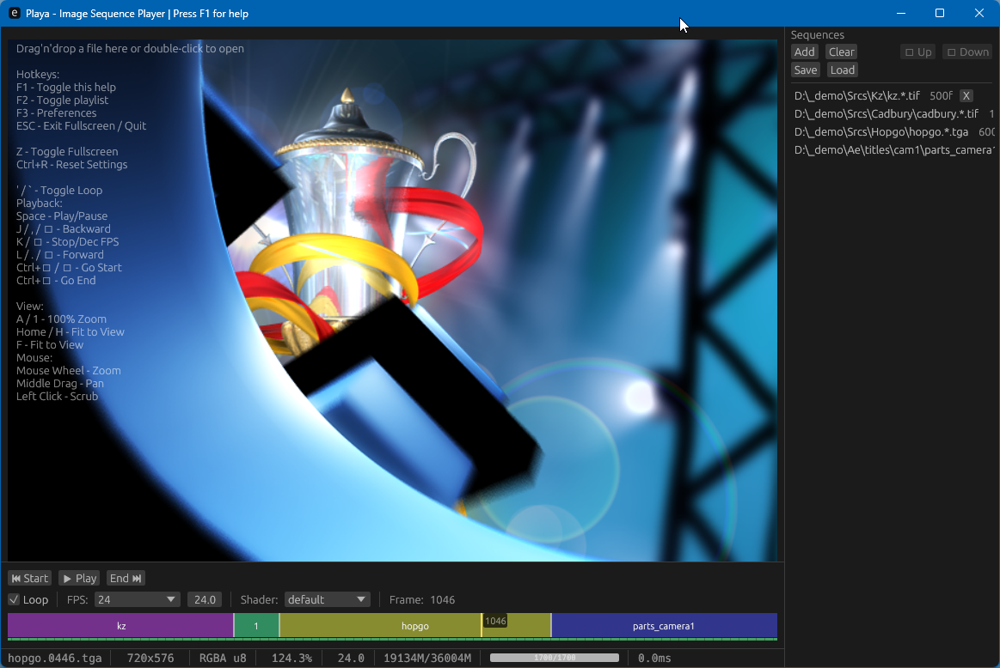

# Playa - Image Sequence Player

[](https://github.com/ssoj13/playa/actions/workflows/release.yml)
[](https://github.com/ssoj13/playa/releases/latest)
[](https://github.com/ssoj13/playa/releases)
[](LICENSE)
[](https://github.com/ssoj13/playa)
[](CHANGELOG.md)

> **Experimental project**: Built to explore Rust's ecosystem and CI/CD patterns while building some cool tools. Production-ready where tested, rough edges expected elsewhere. Open source contributions welcome.



Image sequence player for VFX workflows. Async loading, LRU caching, OpenGL rendering.

## Features

- **Multi-format support**: EXR, PNG, JPEG, TIFF, TGA with fast parallel loading
- **HDR pixel precision**: Native support for 8-bit, 16-bit half-float, and 32-bit float images
- **Drag-and-drop**: Drop any image file - automatically detects and loads the entire sequence
- **Smart sequence detection**: Load one frame (e.g., `render.0001.exr`) - finds all frames automatically
- **Persistent playlist**: Load multiple sequences, auto-saves and restores between sessions
- **Color-coded timeline**: Visual sequence boundaries with real-time frame load indicators
- **Responsive scrubbing**: Instant frame navigation - always responsive even during fast scrubbing, cancels stale loads automatically
- **Cursor-centered zoom**: Mouse wheel zoom centers on cursor position (like Nuke/Houdini)
- **Playback controls**: Standard transport controls (play/pause, JKL shuttle, loop)
- **Viewport controls**: Zoom, pan, fit-to-window, 100% pixel-perfect view
- **Custom GLSL shaders**: Load display shaders from `shaders/` directory - LUTs, color transforms, custom effects
- **Smart memory management**: Automatically manages cache size - never runs out of memory
- **Settings dialog**: Theme switching, font size, preferences (F3)
- **Cinema mode**: Fullscreen playback with hidden UI
- **Persistent settings**: Everything saves automatically - window layout, zoom level, shader selection

## Installation

### Download Pre-built Binaries (Recommended)

Download the latest release for your platform from the [Releases page](https://github.com/ssoj13/playa/releases/latest):

- **Windows**: `playa-x.x.x-x64-windows-setup.exe` (installer) or portable `.exe`
- **macOS**: `playa-x.x.x-x86_64-apple-darwin.dmg` or `playa-x.x.x-aarch64-apple-darwin.dmg`
- **Linux**: `playa-x.x.x-x86_64-linux.AppImage` or `.deb`

All installers include full OpenEXR support with DWAA/DWAB compression.

### Build from Source

Playa supports two EXR backends:

| Backend | Build Command | Dependencies | DWAA/DWAB Support |
|---------|--------------|--------------|-------------------|
| **exrs** (default) | `cargo build --release` | None (pure Rust) | No |
| **OpenEXR** (optional) | `cargo xtask build --release --openexr` | C++ compiler, CMake | Yes |

#### Option 1: Default Build (exrs - Pure Rust)

Fast build with no external dependencies. Suitable for most workflows:

```bash
git clone https://github.com/ssoj13/playa.git
cd playa

# Build with exrs backend (pure Rust, no DLLs)
cargo build --release
```

The compiled binary will be in `target/release/playa` (or `playa.exe` on Windows).

**Limitations**: Cannot load EXR files with DWAA/DWAB compression. Will show helpful error message with build instructions.

#### Option 2: Full OpenEXR Support (C++ Backend)

Supports all EXR compression formats including DWAA/DWAB:

**Prerequisites:**
- Rust 1.70+
- C++ compiler and CMake

```bash
git clone https://github.com/ssoj13/playa.git
cd playa

# Build with OpenEXR backend (full format support)
cargo xtask build --release --openexr

# Or use the wrapper script
./build.sh
```

**Note:** OpenEXR backend compiles C++ libraries (~5-10 minutes first build, then cached).

### Using xtask - Project Build Automation

**What is xtask?**

`xtask` is an idiomatic Rust pattern for build automation using a workspace helper binary. It provides cross-platform task automation without external dependencies (no Makefiles, no Python, no shell scripts).

**Why xtask?**
- **Cross-platform**: Same commands work identically on Windows, Linux, and macOS
- **No external tools**: Pure Rust, uses project's existing toolchain
- **Type-safe**: Catch errors at compile time, not runtime
- **Self-documenting**: Built-in `--help` with structured command definitions
- **Integrated**: Direct access to project workspace and Cargo metadata
- **Maintainable**: Refactor-friendly Rust code instead of brittle shell scripts

**Quick Start (New Contributors):**

```bash
# Bootstrap script handles everything
./bootstrap.cmd        # Windows
./bootstrap.sh         # Linux/macOS

# Shows xtask help and available commands
# Automatically installs missing dependencies (cargo-release, cargo-packager)
# Builds xtask binary if needed
```

**Available Commands:**

```bash
# Build automation
cargo xtask build [--release] [--openexr]  # Full build (default: exrs, --openexr: C++ backend)
cargo xtask post [--release]               # Copy native libraries and shaders (OpenEXR only)
cargo xtask verify [--release]             # Verify all dependencies present
cargo xtask deploy [--install-dir]         # Install to system (local testing)

# Release management
cargo xtask tag-dev [level]        # Create dev tag (v0.1.x-dev), trigger Build workflow
cargo xtask tag-rel [level]        # Create release tag (v0.1.x) on main, trigger Release workflow
cargo xtask pr [version]           # Create Pull Request from dev to main with all commits
cargo xtask changelog              # Generate changelog preview from unreleased commits

# Platform-specific (Linux only, OpenEXR backend)
cargo xtask pre                    # Patch OpenEXR headers for GCC 11+ compatibility
```

**What `cargo xtask build` does:**

**Without `--openexr` (default - exrs backend):**
1. Runs `cargo build [--release]` with pure Rust exrs backend
2. No external dependencies copied (self-contained binary)

**With `--openexr` (OpenEXR C++ backend):**
1. **Linux**: Patches OpenEXR headers for GCC 11+ compatibility
2. **All platforms**: Runs `cargo build [--release] --features openexr`
3. **All platforms**: Copies native libraries (OpenEXR, Imath, zlib) to target directory
4. **All platforms**: Copies shaders from project root
5. **Linux**: Creates necessary symlinks for library loading

**Common Workflows:**

```bash
# Development build (exrs backend - fast, no external deps)
cargo build

# Development build with full OpenEXR support
cargo xtask build --openexr

# Release build and local install (exrs)
cargo build --release
cargo xtask deploy

# Release build and local install (OpenEXR)
cargo xtask build --release --openexr
cargo xtask deploy

# Create dev tag and push (triggers CI Build workflow)
cargo xtask tag-dev patch

# Preview unreleased changelog
cargo xtask changelog

# Create PR from dev to main (typical release workflow)
cargo xtask pr v0.2.0

# Create release from main branch (after merging PR)
git checkout main
git pull
cargo xtask tag-rel patch
```

### Development Dependencies

**Auto-installed by bootstrap script:**
- `cargo-release` - Version bumping and tag creation
- `cargo-packager` - Cross-platform installer generation (v0.11.7)

**Standard Rust tools (usually pre-installed):**
- `rustup` - Rust toolchain manager
- `cargo` - Rust package manager
- `clippy` - Linter (`rustup component add clippy`)
- `rustfmt` - Code formatter (`rustup component add rustfmt`)

**Required for PR workflow:**
- `gh` - GitHub CLI (used by `cargo xtask pr`) - [Installation](https://cli.github.com/)

**Optional tools:**
- `git-cliff` - Changelog generation (used by `cargo xtask changelog`)
- `cargo-audit` - Security vulnerability scanning
- `cargo-llvm-cov` - Code coverage

### GitHub Actions CI/CD

Automated builds on Windows and Linux with optimized multi-tier caching.

#### Workflow Triggers

- **Push to main**: Updates release cache, no artifacts
- **Tags `v*` on main**: Triggers `release.yml` → GitHub Release
- **Tags `v*` NOT on main**: Triggers `build.yml` → Dev artifacts only
- **Manual dispatch**: Available for both workflows

#### Caching Strategy

**Separate caches for release and dev builds:**

| Cache Key | Usage | Contents |
|-----------|-------|----------|
| `playa-windows-release-v1` | Main branch builds/releases | Registry, git, bin, target |
| `playa-linux-release-v1` | Main branch builds/releases | Registry, git, bin, target |
| `playa-windows-dev-v1` | Dev tag builds | Registry, git, bin, target |
| `playa-linux-dev-v1` | Dev tag builds | Registry, git, bin, target |

**Key optimizations:**
- **cargo-packager binary cached** in `~/.cargo/bin/` - saves ~2-3 min/build
- **Conditional install**: Checks if binary exists before `cargo install`
- **Conditional save**: Skips cache save if successfully restored (cache-hit)
- **Split restore/save**: Release workflow saves only from main branch

#### Build Performance

**Typical times:**
- **First build (cold cache)**: ~20-25 minutes (includes OpenEXR compilation)
- **Subsequent builds (warm cache)**: ~10-12 minutes
- **cargo-packager**: Cached (~10 sec check) or installed fresh (~2-3 min)
- **Cache restore/save**: ~1-2 minutes

**Cache benefits:**
- Rust dependencies: Saves ~10-15 minutes
- cargo-packager binary: Saves ~2-3 minutes
- Total speedup: ~13-18 minutes per build

**Problem solved:**
Previous approach compiled OpenEXR (~20 min) and cargo-packager (~2-3 min) every run. New caching brings this down to ~10-12 min for warm builds.

#### GitHub Actions Cache Ref Scoping

**The Problem:**
GitHub Actions caches are scoped by ref (branch/tag). Each tag creates a unique ref:
- Tag `v0.1.54` → ref `refs/tags/v0.1.54`
- Tag `v0.1.55` → ref `refs/tags/v0.1.55`

By default, caches created on one ref cannot be accessed by another ref. This means:
- Each tag would rebuild from scratch (~20 minutes with OpenEXR)
- No cache reuse between releases
- Wasted CI time and resources

**The Solution:**
Use **parent ref inheritance** with split cache operations:

1. **Main branch creates canonical cache**:
   - `actions/cache/save@v4` with condition: `if: github.ref == 'refs/heads/main'`
   - Creates cache with key `playa-windows-release-v1`
   - Ref: `refs/heads/main`

2. **Tags inherit from main**:
   - `actions/cache/restore@v4` (no condition)
   - Looks for key `playa-windows-release-v1`
   - GitHub Actions allows reading caches from parent refs
   - Tags on main automatically find main's cache

3. **Conditional save with cache-hit check**:
   - Skip save if cache was restored: `steps.cache.outputs.cache-hit != 'true'`
   - Prevents redundant cache uploads

**Result:**
- First push to main: ~20 min, creates cache
- Tags on main: ~10 min, reuse main's cache
- Dev tags (not on main): Use separate `*-dev-v1` caches

**Key insight:** GitHub Actions allows child refs (tags) to read caches from parent refs (branches they're based on), but not vice versa. Main branch is the "source of truth" for release caches.

### Standard Rust Development

```bash
# Testing
cargo test                           # Run all unit tests
cargo test --release                 # Run tests in release mode

# Documentation
cargo doc --open                     # Generate and open rustdoc documentation
cargo doc --no-deps --open           # Only document this crate

# Code quality
cargo clippy                         # Run linter
cargo clippy -- -D warnings          # Treat warnings as errors
cargo fmt                            # Format code
cargo fmt -- --check                 # Check formatting without modifying

# Build variants
cargo build                          # Debug build
cargo build --release                # Release build (optimized)
cargo clean                          # Clean build artifacts
```

#### Linux-Specific Build Notes

**Note:** These instructions apply only to the OpenEXR C++ backend (`--openexr` feature). The default exrs backend requires no external dependencies.

**OpenEXR GCC 11+ Header Patching:**

OpenEXR 3.0.5 headers are missing `#include <cstdint>`, causing compilation errors with GCC 11+:
```
error: 'uint64_t' has not been declared
```

`cargo xtask pre` automatically patches 3 header files in `~/.cargo/registry/src/`:
- `ImfTiledMisc.h`
- `ImfDeepTiledInputFile.h`
- `ImfDeepTiledInputPart.h`

The patching is **idempotent** and **version-agnostic** - safe to run multiple times.

See: https://github.com/AcademySoftwareFoundation/openexr/issues/1157

**Native Libraries (7 Required):**

| Library | Purpose |
|---------|---------|
| OpenEXR Core (4 libs) | EXR reading/writing, utilities, threading, exceptions |
| Imath | Math library |
| Zlib | Compression |
| OpenEXR-C | C API wrapper from openexr-sys |

**Library Copy Process (`cargo xtask post`):**

1. **Locate libraries** compiled by `openexr-sys`:
   - Searches `target/release/build/openexr-sys-*/out/` for versioned `.so` files
   - Example: `libOpenEXR-3_2.so.31.0.0`, `libImath-3_1.so.29.9.0`

2. **Copy to target directory**:
   - Destination: `target/release/` (next to `playa` binary)
   - Preserves original versioned filenames

3. **Create SONAME symlinks**:
   - `libOpenEXR-3_2.so -> libOpenEXR-3_2.so.31.0.0`
   - `libOpenEXRCore-3_2.so -> libOpenEXRCore-3_2.so.31.0.0`
   - `libOpenEXRUtil-3_2.so -> libOpenEXRUtil-3_2.so.31.0.0`
   - `libImath-3_1.so -> libImath-3_1.so.29.9.0`
   - Plus OpenEXR-C wrapper lib

**Why this is needed:**
- `openexr-sys` build creates libraries with full SONAME versions
- Rust linker expects generic `.so` names without version suffixes
- Without symlinks: `error while loading shared libraries: libOpenEXR-3_2.so: cannot open shared object file`

**RPATH Configuration:**

`.cargo/config.toml` sets RPATH to `$ORIGIN`, so the executable searches for `.so` files in its own directory:
```toml
[target.x86_64-unknown-linux-gnu]
rustflags = ["-C", "link-arg=-Wl,-rpath,$ORIGIN"]
```

No `LD_LIBRARY_PATH` needed! Combined with symlinks from `cargo xtask post`, the binary is fully self-contained.

**Troubleshooting:**

Build fails with "uint64_t has not been declared":
```bash
cargo xtask pre
cargo build --release
```

Libraries not found when running:
```bash
cargo xtask verify --release
cargo xtask post --release  # If missing
```

After `cargo clean`:
```bash
cargo xtask build --release  # Re-patches automatically
```

#### Windows-Specific Build Notes

**Note:** These instructions apply only to the OpenEXR C++ backend (`--openexr` feature). The default exrs backend requires no external DLLs.

**Native Libraries (DLL Management):**

Windows requires `.dll` files alongside the executable. The same 7 OpenEXR/Imath/zlib libraries are needed, just as `.dll` instead of `.so`.

**Library Copy Process (`cargo xtask post`):**

1. **Locate DLLs** compiled by `openexr-sys`:
   - Searches `target/release/build/openexr-sys-*/out/bin/` for `.dll` files
   - Example: `OpenEXR-3_2.dll`, `Imath-3_1.dll`, `zlib.dll`

2. **Copy to target directory**:
   - Destination: `target/release/` (next to `playa.exe`)
   - Windows DLLs don't use versioned SONAME - simpler than Linux

**Why this is needed:**
- Windows searches for DLLs in the same directory as the executable
- Without DLLs: `The code execution cannot proceed because OpenEXR-3_2.dll was not found`
- No PATH modification needed - self-contained binary

**No RPATH equivalent:**
- Windows automatically searches the executable's directory first
- No special linker flags required (unlike Linux `$ORIGIN`)

## Usage

### Launch
```bash
# Start with empty player (drag-and-drop or file dialog)
playa

# Load specific file or sequence
playa path/to/image.0001.exr
```

### Keyboard Shortcuts

**Playback Controls:**
- `Space` - Play/Pause
- `J` / `,` / `←` - Jog backward / decrease speed
- `K` / `↓` - Stop playback / decrease FPS
- `L` / `.` / `→` - Jog forward / increase speed
- `↑` - Go to start
- `Ctrl+←` - Jump to start
- `Ctrl+→` - Jump to end
- `'` / `` ` `` - Toggle loop

**Viewport:**
- `F` - Fit to window (auto-fit mode)
- `A` / `1` / `Home` / `H` - 100% zoom
- `Mouse Wheel` - Zoom in/out (center on cursor)
- `Middle Mouse Drag` - Pan
- `Left Click + Drag` - Scrub timeline

**UI:**
- `F1` - Toggle help overlay
- `F2` - Toggle playlist panel
- `F3` - Toggle settings dialog
- `Z` - Toggle fullscreen (cinema mode)
- `ESC` - Exit fullscreen / Quit
- `Q` - Quit
- `Ctrl+R` - Reset settings to default

### Visual Sequence Navigation

The time slider provides visual feedback for multi-sequence playback:
- **Color-coded zones**: Each loaded sequence is displayed with a unique color on the timeline
- **Sequence boundaries**: White vertical dividers mark where sequences start/end
- **Load indicator bar**: Colored blocks below timeline show frame load status:
  - Dark gray: Placeholder (not requested)
  - Blue: Header only (detected but not loaded)
  - Orange: Currently loading
  - Green: Fully loaded
  - Red: Load error
- **Adaptive labels**: Sequence names appear on the timeline when space permits
- **Instant navigation**: Click or drag anywhere on the timeline to jump to that frame

This makes it easy to identify and navigate between different sequences in your playlist at a glance.

### Settings Dialog

Press `F3` to open the settings dialog with TreeView categories:

**UI Category:**
- **Font Size**: Adjust global UI font size (10-18px, default 13px)
- **Dark Mode**: Toggle between dark and light themes

Settings are automatically persisted to `playa.json`.

## Architecture

### Core Components

```
┌─────────────┐
│  PlayaApp   │  Main application (egui/eframe)
└──────┬──────┘
       │
       ├──── Player ───────┐
       │                   │
       │              ┌────▼────┐
       │              │  Cache  │  LRU cache + async loader + epoch counter
       │              └────┬────┘
       │                   │
       │              ┌────▼────────┐
       │              │  Sequences  │  Pattern-based frame lists
       │              └────┬────────┘
       │                   │
       │              ┌────▼────┐
       │              │ Frames  │  Individual images with status
       │              └─────────┘
       │
       ├──── Viewport ────┐
       │                  │
       │            ┌─────▼──────────┐
       │            │ ViewportState  │  Zoom/pan/fit modes
       │            └────────────────┘
       │
       ├──── Scrubber ────  Timeline interaction
       │
       ├──── TimeSlider ──  Custom time slider widget + load indicator
       │
       ├──── Shaders ─────  OpenGL display shaders
       │
       └──── Prefs ───────  Settings dialog with TreeView
```

### Module Breakdown

#### `main.rs`
Entry point and main application loop. Handles:
- CLI argument parsing
- Window initialization (egui/eframe)
- Event loop and UI rendering
- Keyboard/mouse input routing
- Settings persistence (JSON)
- Global font size application

#### `player.rs`
Playback state manager. Controls:
- Play/pause/stop
- Frame navigation (jog, shuttle)
- FPS control with presets
- Loop mode
- Delegates frame access to Cache

#### `cache.rs`
Intelligent caching system with multi-threaded architecture:
- **LRU eviction**: Manages memory budget (default 50% system RAM)
- **Epoch counter**: Atomic counter for cancelling stale load requests during scrubbing
- **Worker pool**: 75% of CPU cores for parallel loading
- **Load queue**: mpsc channel-based task distribution with epoch tagging
- **Preload thread**: Background spiral loading from current frame
- **Sequence management**: Multi-sequence playlist support
- **Frame status tracking**: Provides frame load state for visualization

**Caching strategy:**
1. On-demand loading: Loads frame when accessed
2. Spiral preload: Loads frames in order: 0, +1, -1, +2, -2, ...
3. Epoch-based cancellation: Workers skip requests with old epoch on scrub/seek
4. Memory-aware: Evicts least-recently-used frames when over budget
5. Status sync: Updates frame status (Header → Loading → Loaded/Error)

**Epoch Counter Pattern:**
- `current_epoch: Arc<AtomicU64>` increments on every scrub/seek
- Workers check `req.epoch != current_epoch` and skip stale requests
- Prevents wasted work on frames user has already moved past

#### `sequence.rs`
Pattern-based frame sequence detection:
- Auto-detects sequences from single file (e.g., `render.0001.exr` → `render.*.exr`)
- Glob pattern matching
- Frame number extraction with padding detection
- Directory scanning for multiple sequences
- Header-only resolution reading (fast)

#### `frame.rs`
Individual frame with thread-safe async loading:
- **Status states**: Placeholder → Header → Loading → Loaded/Error
- **Arc<Mutex<FrameData>>**: Thread-safe shared ownership
- **Format loaders**: EXR (OpenEXR), PNG/JPEG/TIFF (image-rs)
- **Color conversion**: Linear → sRGB for EXR
- **Green placeholder**: Visible indicator for unloaded frames
- **Status API**: `frame.status()` for load indicator visualization

#### `viewport.rs`
Display transformation and interaction:
- **Modes**: AutoFit (scales to window), Auto100 (1:1 pixels), Manual (user control)
- **Zoom**: Mouse wheel with cursor-centered scaling
- **Pan**: Middle-mouse drag
- **OpenGL rendering**: Custom shader pipeline

#### `scrub.rs`
Interactive timeline scrubbing:
- Left-click/drag to navigate frames
- Visual feedback (vertical line + frame number)
- Auto-pauses playback during scrub
- Maps mouse X to frame based on image bounds
- Triggers epoch counter increment for stale request cancellation

#### `timeslider.rs`
Custom time slider widget with sequence visualization:
- **Color-coded zones**: Each sequence rendered with unique color (hash-based)
- **Visual dividers**: Vertical lines marking sequence boundaries
- **Adaptive labels**: Sequence names/numbers displayed when space permits
- **Load indicator**: Colored blocks showing frame status (cached for performance)
- **Cache invalidation**: Uses `cached_frames_count()` to detect when to rebuild
- **Stateless immediate mode**: Fully synchronized with player state
- **Interactive**: Click/drag to navigate, automatic playhead tracking
- **HSV color generation**: Stable colors derived from sequence pattern hash

**Load Indicator Implementation:**
- Queries `cache.get_frame_stats()` for all frame statuses
- Caches result in `egui::Memory` with version key
- Invalidates cache when `cached_frames_count()` changes
- Draws colored blocks: Dark gray (Placeholder), Blue (Header), Orange (Loading), Green (Loaded), Red (Error)

#### `shaders.rs`
OpenGL shader management:
- Built-in shaders (default, checker, etc.)
- Custom shader loading from `shaders/` directory
- Runtime shader switching

#### `prefs.rs`
Settings dialog with TreeView navigation:
- **AppSettings struct**: Centralizes all user preferences
- **SettingsCategory enum**: General, UI categories
- **TreeView integration**: Uses `egui_ltreeview` for hierarchical navigation
- **Font size control**: Global UI font size (10-18px with live preview)
- **Theme toggle**: Dark/light mode switching
- **Persistence**: Selected category and all settings saved to JSON
- **Window layout**: 700×500 default, resizable with ScrollArea

## Data Flow

```
User Action (drag-drop / file dialog / CLI arg)
    │
    ▼
load_sequence(PathBuf)
    │
    ├──► cache.ingest(paths)
    │        │
    │        ├──► Sequence::detect() ──► Parse patterns
    │        │                           Extract frame numbers
    │        │                           Create Frame objects (status: Header)
    │        │
    │        └──► append_seq() ──────► Add to cache.sequences
    │                                   Update global frame range
    │                                   Rebuild frame_paths_cache
    │
    └──► signal_preload() ─────────► Preload thread wakes up
                                      Increments epoch counter
                                      Sends LoadRequests with current epoch

Playback Update Loop
    │
    ▼
player.update()
    │
    ├──► Advance frame based on FPS/direction
    │
    └──► cache.get_frame(idx)
             │
             ├──► Check LRU cache ───► HIT: update access time, return frame
             │
             └──► MISS: Send LoadRequest with current epoch
                         │
                         ▼
                  Worker threads (75% cores)
                         │
                         ├──► Check epoch ────► Stale? Skip request
                         │
                         ├──► frame.load() ─────► Detect format (EXR/PNG/etc)
                         │                        Update status: Loading
                         │                        Load pixels from disk
                         │                        Convert color space
                         │                        Update status: Loaded/Error
                         │
                         └──► Send LoadedFrame via channel
                                     │
                                     ▼
                              cache.process_loaded_frames()
                                     │
                                     ├──► Ensure space (LRU eviction)
                                     ├──► Insert into cache
                                     ├──► Update sequence frame reference
                                     └──► Send CacheMessage for UI updates

Scrub/Seek Event
    │
    ▼
    ├──► Increment epoch counter ────► Cancel all in-flight requests
    │
    └──► Trigger preload with new epoch

Render Loop
    │
    ▼
UI update
    │
    ├──► Apply global font size from settings
    │
    ├──► Apply theme (dark/light) from settings
    │
    ├──► Get current frame from cache
    │
    ├──► Upload texture to GPU (if frame changed)
    │
    ├──► TimeSlider with load indicator
    │        │
    │        ├──► Check cached_frames_count()
    │        ├──► Rebuild indicator cache if changed
    │        └──► Draw colored blocks for each frame
    │
    └──► ViewportRenderer.render()
             │
             └──► Apply viewport transform (zoom/pan)
                  Apply shader
                  Draw quad with texture

Settings Dialog (F3)
    │
    ▼
    ├──► TreeView navigation (General / UI)
    │
    ├──► Font size slider ───► Update AppSettings.font_size
    │                           Apply globally on next frame
    │
    ├──► Dark mode toggle ───► Update AppSettings.dark_mode
    │                           Switch theme immediately
    │
    └──► Auto-save to playa.json
```

## Performance Characteristics

- **Startup**: Instant (lazy loading)
- **Sequence detection**: Fast (header-only reads, ~1-5ms per file)
- **Frame loading**: Parallel (75% CPU cores)
- **Memory**: Self-limiting (50% system RAM, configurable)
- **Scrubbing**: Responsive (epoch-based cancellation + preloaded cache)
- **Playback**: Smooth (async loading stays ahead of playback)
- **Load indicator**: Efficient (cached, O(1) status lookups, rebuilds only on cache changes)
- **LRU cache**: Optimized (no stale keys in access_order, skips dead entries during eviction)

## Configuration

Settings auto-save to `playa.json` in the working directory:
- FPS
- Loop mode
- Shader selection
- Font size (global UI)
- Dark/light theme
- Viewport state (zoom/pan/mode)
- Playlist (sequence references)
- Window position/size
- Panel widths (playlist)
- Settings dialog state (selected category)

Cache state (sequences + current frame) auto-saves to `playa_cache.json` for instant restoration on restart.

## Technical Stack

- **UI**: egui 0.33 + eframe
- **TreeView**: egui_ltreeview 0.6.0 (with persistence feature)
- **Graphics**: OpenGL via glow + egui_glow
- **Image**:
  - **EXR (default)**: exrs via image 0.25 (pure Rust)
  - **EXR (optional)**: openexr 0.11 (C++ bindings, `openexr` feature)
  - **Other formats**: image 0.25 (PNG/JPEG/TIFF/TGA/HDR)
- **Async**: std::thread + crossbeam-channel + mpsc
- **Concurrency**: AtomicU64 for epoch counter, Arc<Mutex> for shared state
- **CLI**: clap 4.5
- **Logging**: env_logger (set `RUST_LOG=debug` for verbose output)

## License

See LICENSE file for details.

## Contributing

We welcome contributions! Please see our [Contributing Guide](CONTRIBUTING.md) for details on:
- Commit message conventions (Conventional Commits)
- Development workflow and tools
- Release process
- CI/CD architecture

See [CHANGELOG.md](CHANGELOG.md) for project history.

